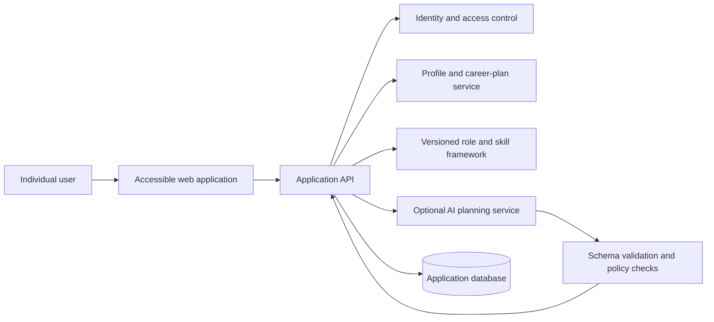

# AtellixCareer

**An AI-assisted career planning platform for technical learners and job seekers.**

> **Project status:** Concept / planning. This folder currently contains product documentation only; there is no application implementation or verified assessment model here.

## Overview

AtellixCareer is intended to help people understand the skills required for a technical role, compare those requirements with their current experience, and turn the resulting gaps into a practical learning plan. The product should make career planning more understandable and actionable without presenting an AI-generated assessment as an authoritative judgment of a person's ability or employability.

The product is planned for two related audiences:

- **Individuals (B2C):** students, career changers, and technology professionals exploring their next role.
- **Organizations (B2B):** education providers and employers mapping learning pathways to role-specific skill frameworks.

The individual experience is the proposed starting point. Organization-facing workflows should follow only after the core experience, privacy model, and assessment quality have been validated.

## Product principles

1. **Explain recommendations.** Show the role requirements, evidence, assumptions, and confidence behind a suggested skill gap or learning step.
2. **Keep people in control.** Let users correct their profile, reject recommendations, and edit or dismiss a generated plan.
3. **Support, do not screen.** The initial product is a planning aid for individuals, not an automated hiring, admissions, or employment decision system.
4. **Respect privacy.** Collect only information needed to provide the requested experience and give users clear controls for access, export, and deletion.
5. **Treat AI as fallible.** Validate structured output, communicate uncertainty, and provide useful non-AI pathways when a model is unavailable.
6. **Design for accessibility.** Make plans usable with assistive technology, keyboard navigation, and different learning needs.

## Proposed MVP

### Individual career plan

- Create and update a profile with skills, projects, experience, and career interests.
- Choose a target technical role or select from a clearly described role catalogue.
- Review the skills and proficiency expectations associated with that role.
- Complete a structured self-assessment and optionally provide supporting evidence, such as project links or descriptions.
- Compare self-reported skills with the selected role framework and review suggested areas to develop.
- Generate an editable, step-by-step learning plan with milestones, estimated effort, and links to learning resources.
- Track progress, revise goals, and regenerate a plan when the user's profile or target changes.
- Access clear loading, empty, validation, error, and AI-unavailable states.

### Quality and trust requirements

- Distinguish user-provided information from inferred or AI-generated content.
- Explain why a skill or learning step appears in a recommendation.
- Allow corrections to skill ratings and generated plans before they are saved.
- Avoid unsupported claims such as guaranteed employment outcomes, job readiness, or objective candidate rankings.
- Support a non-AI workflow using role requirements and manually selected learning steps.

## Out of scope for the initial release

- Automated candidate ranking, hiring recommendations, or employment eligibility decisions.
- Claims that an assessment predicts job performance or guarantees a career outcome.
- Unreviewed scraping or reuse of personal profiles, résumés, or portfolio data.
- Enterprise talent analytics, organization-wide benchmarking, or integrations with applicant-tracking systems.
- Paid course placement or recommendations influenced by undisclosed commercial arrangements.

## Core user journey

1. A user chooses a target role and reviews what the role framework means.
2. The user enters skills and experience or completes a guided self-assessment.
3. AtellixCareer presents a transparent comparison, including missing or uncertain evidence.
4. The user reviews and edits suggested priorities and learning milestones.
5. The user follows the plan, records progress, and updates their goals over time.

## Proposed architecture

The following diagram describes a possible future architecture; it is not a description of deployed services.

### Proposed technology choices

| Area | Proposed direction |
| --- | --- |
| Client | Responsive web application using a modern component-based framework |
| API | Versioned HTTP API with explicit request and response schemas |
| Data | Relational or document database selected after the data model is defined |
| Authentication | Established identity provider or a well-maintained authentication library |
| AI | Provider-independent service boundary with structured, validated responses |
| Observability | Privacy-conscious application logs, metrics, tracing, and error reporting |

These are planning options, not committed dependencies or technologies.

## Data, privacy, and responsible AI

Career profiles can contain sensitive personal information. Before collecting real user data:

- Document the purpose, retention period, and access rules for each data category.
- Obtain clear consent before processing optional profile material or sending it to an AI provider.
- Minimize the information sent to external providers; exclude credentials and unrelated personal data.
- Provide account-level export and deletion processes and define retention for backups and logs.
- Apply authorization checks to every profile, assessment, and plan operation.
- Avoid using protected characteristics or proxies for them to infer skill, potential, or employability.
- Test role frameworks and recommendations for coverage, accessibility, and disparate failure patterns.
- Keep AI output advisory, reviewable, and editable; do not silently change a user's profile or plan.
- Record model and framework versions needed to understand how a recommendation was produced.

Applicable privacy, consumer-protection, accessibility, and AI regulations must be assessed for the jurisdictions and deployment model before launch.

## Success measures

Potential measures to validate with users include:

- Percentage of users who complete a first role assessment and save a plan.
- User-rated clarity and usefulness of skill-gap explanations.
- Plan completion and return rates, interpreted without overstating career outcomes.
- Frequency of corrections or dismissals, used to identify quality problems rather than penalize users.
- Recommendation quality, accessibility, and error rates across relevant roles and user groups.

Do not treat employment, interview, or salary outcomes as attributable to the product without an appropriate study and clear user consent.

## Roadmap

- [ ] Interview learners, career changers, and educators to validate the core problem.
- [ ] Define an initial role and skill framework, its sources, versioning, and review process.
- [ ] Specify profile, assessment, plan, consent, export, and deletion data flows.
- [ ] Prototype the individual assessment and editable learning plan without AI.
- [ ] Define recommendation schemas, validation rules, quality evaluations, and fallback behavior.
- [ ] Build and test the MVP with accessibility and privacy reviews.
- [ ] Pilot with a small, consenting group and publish limitations and support channels.
- [ ] Reassess organization-facing features only after the individual workflow is validated.

## Development and contribution

No application setup or run commands are provided because this folder does not currently contain an implemented application. When implementation begins, add reproducible setup instructions, environment-variable documentation without secrets, test commands, deployment guidance, and a documented security-reporting channel.

Contributions to product planning should keep assumptions explicit, cite sources for role frameworks, and preserve the principles and limitations described above.
