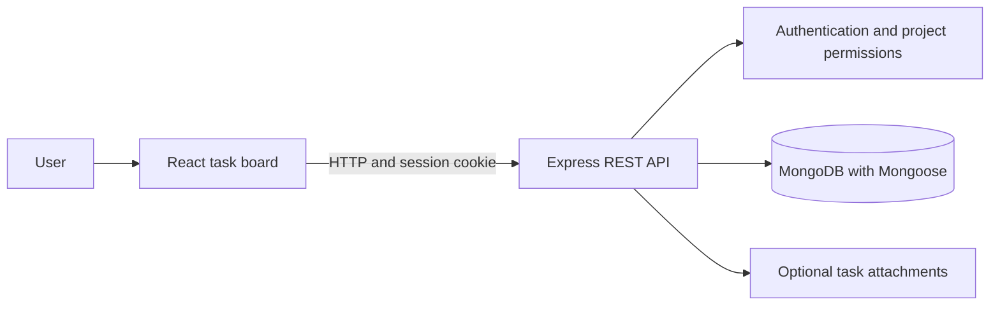

# AtellixDo

**A planned full-stack task and todo management application.**

> **Status:** Planned. This folder currently contains the project brief only. The Week-17 task API is a learning foundation, not an integrated or verified AtellixDo backend.

## Project Goal

AtellixDo will bring a clear, useful task workflow together in one application: organize work into projects, create and assign tasks, track progress, and break larger tasks into subtasks. The goal is to turn the cohort's task-management backend practice into a complete application with a usable frontend.

## Planned MVP

- Create an account, sign in, and manage an authenticated session.
- Create and manage projects or workspaces.
- Create, edit, assign, and delete tasks.
- Track task status with `TODO`, `IN_PROGRESS`, and `DONE` states.
- Add subtasks and show task progress.
- Filter tasks by project, assignee, and status.
- Provide loading, empty, validation, and error states in the interface.

File attachments and richer collaboration features can follow after the core workflow is reliable.

## Product Positioning

The initial audience is small development teams, student project groups, and solo builders who need a lightweight place to plan and track work. The core task workflow must remain useful with AI turned off; AI should reduce planning effort, not become a requirement for managing tasks.

## Planned AI Assistance

- **Natural-language task capture:** Turn a prompt such as "prepare the demo by Friday" into a proposed title, description, priority, and due date for the user to review.
- **Subtask suggestions:** Draft a checklist from a task description, with every item editable before it is saved.
- **Planning suggestions:** Recommend a short list of next tasks using project membership, task status, and dates available to the current user.
- **Progress summaries:** Summarize completed, blocked, and upcoming work for a project or selected date range.

These are roadmap ideas, not existing features. The first AI release should generate suggestions only; it must not silently create, assign, reprioritize, or complete tasks.

## AI Safety and Product Trust

- Enforce the same project membership and role checks for AI requests as for ordinary task requests.
- Send only the minimum task context needed for a requested suggestion; never include credentials or unrelated workspace data.
- Require the user to review and confirm generated task changes.
- Add provider timeouts, rate limits, usage caps, and a clear non-AI fallback.
- Explain when content is AI-generated and let users edit or discard it.

## Product Launch Path

1. Repair and test the Week-17 API foundation; define the task data model and API contract.
2. Ship a dependable web app for projects, tasks, subtasks, assignment, and status changes without AI.
3. Pilot with a small group and use feedback to improve onboarding, permissions, and task workflows.
4. Add one opt-in AI feature, measure whether it saves users time, then decide whether to expand the assistant.
5. Prepare a public launch with deployment, screenshots, support/contact details, privacy information, and clear limits for AI usage.

## Planned Architecture

## Proposed Technology Stack

| Area                   | Planned technology                               |
| ---------------------- | ------------------------------------------------ |
| Frontend               | React, React Router, and Tailwind CSS            |
| Backend                | Node.js and Express                              |
| Database               | MongoDB with Mongoose                            |
| Authentication         | JWT in HTTP-only cookies                         |
| Validation and uploads | Express validation and Multer, where appropriate |

These are plans, not claims about code already implemented in this folder.

## Starting Points in This Repository

- [Week-17 backend project and API notes](../../Week-17/Readme.md) cover authentication, project permissions, tasks, subtasks, and attachments. Repair and test its task routes before reusing them.
- [Week-08 ToDo exercise](../../Week-08/Week-08-A/ToDo%20App/index.html) provides a small DOM-based interface example.
- [Week-12 Kanban board](../../Week-12/Projects/KanBanBoard/index.html) is a reference for task columns, editing, and drag-and-drop interactions.

## Milestones

- [ ] Stabilize and test the Week-17 task and project APIs.
- [ ] Define the AtellixDo data model and API contract.
- [ ] Build the React task board and connect it to the API.
- [ ] Add authentication, permissions, validation, and useful error states.
- [ ] Add automated tests, screenshots, setup instructions, and a live demo.

The project is ready to be promoted in the portfolio once the core workflows run end to end; until then, this README is its scope and progress tracker.
