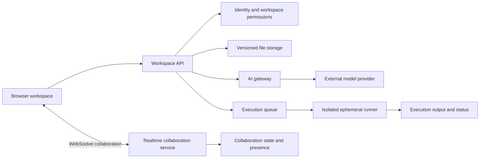

# AtellixEngine

**A planned collaborative browser-based development workspace for software engineering teams.**

> **Project status:** Concept / planning. This folder currently contains product documentation only; there is no implemented editor, collaboration service, AI integration, or code-execution environment here.

## Overview

AtellixEngine is intended to bring collaborative code editing, team workspaces, AI-assisted development, and isolated code execution into a browser-based environment. The long-term direction is to reduce setup friction for software teams while preserving clear boundaries between users, projects, AI providers, and untrusted code.

The first product should validate the shared editing and workspace experience before expanding into hosted development environments or autonomous AI agents.

## Intended users

- Software engineering teams collaborating on code and prototypes.
- Educators or project groups who need a shared development environment.
- Individual developers who want to start or review a project without configuring a local toolchain.

## Product principles

1. **Collaboration must be understandable.** Users should see who is editing, whether changes are saved, and how concurrent edits are reconciled.
2. **The project remains under user control.** AI suggestions are reviewable, attributable, and reversible; generated changes are never silently applied.
3. **Code execution is untrusted by default.** User code must run in a strongly isolated environment with explicit resource and network limits.
4. **Privacy is part of the workspace boundary.** Project membership governs access to files, presence, execution output, and AI context.
5. **Reliability takes precedence over novelty.** Saving, recovery, and clear failure handling must work before advanced AI workflows are added.
6. **Security is designed in.** Threat modeling, dependency hygiene, auditability, and incident response are launch requirements.

## Proposed MVP

### Workspace and editing

- Create a workspace and invite collaborators with explicit roles.
- Create, open, and edit text files in a browser-based editor.
- Save changes durably and communicate save status to each participant.
- Support concurrent editing using a well-tested collaboration strategy, such as CRDTs or operational transformation, selected after prototyping.
- Display collaborator presence and file-level activity without exposing data to unauthorized users.
- Recover gracefully from reconnects and transient service failures.

### AI assistance

- Stream assistant responses with visible generation and completion states.
- Provide selected, minimal project context only when needed for a user-requested operation.
- Present code edits as a diff or proposal for user review and acceptance.
- Enforce the same workspace permissions for AI context retrieval as for ordinary file access.
- Make provider errors, timeouts, and usage limits visible and provide a usable non-AI path.

### Code execution

- Run supported commands only in short-lived, isolated execution environments.
- Apply CPU, memory, storage, process, and wall-clock limits.
- Restrict network access by default and provide no access to host credentials or workspace secrets.
- Capture output and execution status without allowing one run to interfere with another user's environment.
- Terminate and clean up the execution environment after its lifetime or on explicit cancellation.

## Out of scope for the first release

- General-purpose hosted cloud development environments with persistent machine state.
- Autonomous agents that modify files, run commands, or deploy code without user approval.
- Public execution of arbitrary code without a completed security review and abuse controls.
- Production hosting, secret management, or deployment pipelines.
- Claims of end-to-end confidentiality until the complete infrastructure and provider data flows support them.

## Typical workflow

1. A team member creates a workspace and grants access to collaborators.
2. Collaborators edit files and see save and presence state.
3. A user requests AI help; the workspace checks permissions and supplies only relevant context.
4. The assistant streams a suggestion, which the user reviews as a diff before applying.
5. A user starts an execution; the system runs it in an isolated, resource-limited environment and returns output.
6. The workspace records the outcome and safely expires temporary execution resources.

## Proposed architecture

This diagram is a planning model, not a description of deployed services.

### Proposed technology choices

| Area | Proposed direction |
| --- | --- |
| Client | Browser-based editor with accessible controls and resilient reconnect behavior |
| Realtime | WebSocket transport with a CRDT or operational-transformation library |
| API | Authenticated, versioned service with workspace-scoped authorization |
| Persistence | Durable file/version storage and separately managed collaboration state |
| AI | Provider gateway with context minimization, streaming, quotas, and schema validation |
| Execution | Ephemeral sandbox or microVM/container isolation evaluated for the threat model |
| Operations | Metrics, tracing, structured logs, capacity limits, backups, and incident procedures |

Technology selection requires prototypes and a security review. A container alone must not be assumed to provide sufficient isolation for hostile code.

## Security and privacy requirements

Before enabling shared workspaces or code execution:

- Define workspace roles and enforce authorization on every API, WebSocket, file, AI, and execution operation.
- Authenticate WebSocket connections, authorize room membership, validate messages, and limit connection and message rates.
- Protect against cross-workspace data leakage in collaboration state, logs, search, AI context, and execution results.
- Run user code with least privilege, no host mounts, no privileged mode, no ambient credentials, strict quotas, and default-deny network policy.
- Prevent sandbox escape paths through kernel, runtime, dependency, and image updates; maintain a vulnerability response process.
- Store secrets outside source files and never pass workspace secrets to AI providers or execution environments by default.
- Define retention, access, and deletion rules for code, prompts, generated content, execution logs, and backups.
- Add abuse prevention, resource quotas, cancellation, and audit events for sensitive workspace and execution actions.
- Threat-model prompt injection and malicious files; treat repository content as untrusted input to AI systems.
- Publish clear provider disclosures and avoid making confidentiality guarantees that the implementation cannot meet.

## Reliability and operational expectations

- Make file persistence and collaboration recovery behavior explicit and testable.
- Monitor connection success, edit propagation, save latency, error rates, runner queue time, and execution cleanup.
- Bound WebSocket connections, room sizes, message sizes, AI output, and execution duration.
- Provide graceful behavior during AI provider outages and runner capacity exhaustion.
- Document backup, restore, incident response, and service recovery procedures before production use.

## Roadmap

- [ ] Validate collaboration and browser-workspace needs with target teams.
- [ ] Prototype concurrent editing and define conflict, persistence, and recovery semantics.
- [ ] Specify workspace roles, threat model, data boundaries, and abuse controls.
- [ ] Build a non-AI shared editing prototype with durable save and reconnect handling.
- [ ] Add streaming AI suggestions with permission-aware context and reviewable diffs.
- [ ] Evaluate and red-team isolated execution before exposing it to users.
- [ ] Pilot with a limited group and measure reliability, usability, and operating costs.
- [ ] Consider hosted development environments and agent workflows only after the core platform is secure and dependable.

## Success measures

Potential measures to validate during a pilot include:

- Time to create a workspace and make the first saved edit.
- Edit propagation latency and successful recovery after disconnects.
- Save durability and collaboration error rates under representative concurrency.
- AI suggestion review and acceptance rates, measured alongside user-reported usefulness.
- Execution completion, queue time, resource use, and cleanup success.
- Security findings, abuse rates, and cross-workspace authorization test results.

Do not optimize for AI usage or execution volume at the expense of user control, security, or workspace reliability.

## Development and contribution

No application setup or run commands are provided because this folder does not currently contain an implemented application. When implementation begins, document required tooling, local services, environment variables without secrets, test and security-check commands, supported execution limits, deployment, and incident reporting.

Contributions that affect collaboration protocols, permission boundaries, AI context, or code execution should include tests and document their security and operational implications.
