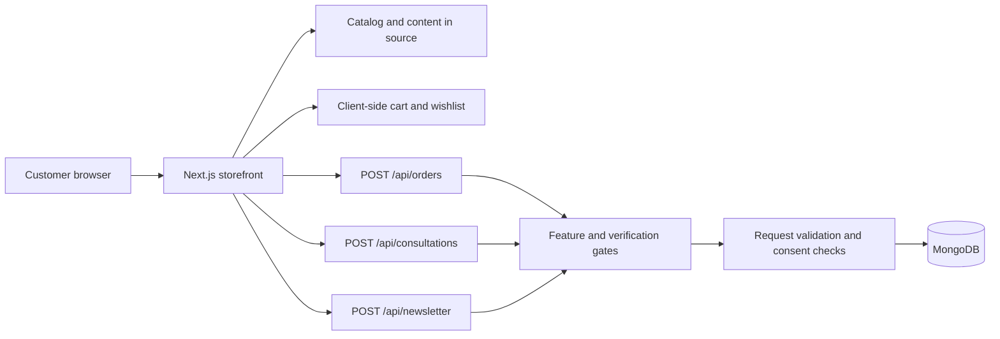

# AtellixHome

**A responsive furniture storefront built with Next.js.**

AtellixHome presents a furniture catalog, collection filters, product details, a shopping cart, saved items, and contact options. Optional server-backed order requests, consultation requests, and newsletter signups are implemented behind explicit verification gates.

> **Operational status:** This project is not ready to operate as a live shop. Catalog and business claims have not been independently verified. Payment processing is not implemented. Customer-submission endpoints remain disabled by default and must not be enabled until the verification requirements in this document are complete.

## Contents

- [Capabilities](#capabilities)
- [Technology](#technology)
- [Requirements](#requirements)
- [Getting started](#getting-started)
- [Configuration](#configuration)
- [Application architecture](#application-architecture)
- [Server-backed submissions](#server-backed-submissions)
- [Security and privacy](#security-and-privacy)
- [Quality checks](#quality-checks)
- [Project structure](#project-structure)
- [Release readiness](#release-readiness)

## Capabilities

### Storefront experience

- Responsive landing page, furniture collections, and product catalog.
- Client-side product search, category filtering, sorting, and wishlist filtering.
- Product quick views, finish selection, cart controls, and order-request form.
- Persistent cart and saved-item state in the browser.
- Consultation and newsletter forms with visible submission feedback.
- Light/dark theme toggle, responsive navigation, and accessible dialog controls.
- Product, image, and legal-information content maintained in project data and assets.

### Current boundaries

- Order submission records an **unpaid order request** only. No payment is collected or processed.
- Delivery fees, final order terms, inventory, and order confirmation are not calculated or verified.
- Consultation requests are stored; no notification or appointment scheduling integration is connected.
- Newsletter signups are stored; email delivery, unsubscribe management, and marketing automation are not connected.
- MongoDB-backed submissions return `503 Service Unavailable` until their required feature flags are explicitly enabled.
- The project does not currently provide customer accounts, an administrative catalog-management interface, or an order-management dashboard.

## Technology

| Area                | Technology                         |
| ------------------- | ---------------------------------- |
| Framework           | Next.js App Router                 |
| UI                  | React                              |
| Styling             | Tailwind CSS 4                     |
| Animation           | Framer Motion                      |
| Database driver     | MongoDB Node.js driver             |
| Tests               | Vitest, Testing Library, and jsdom |
| Lint and formatting | ESLint and Prettier                |

## Requirements

- Node.js **20.9 or newer**.
- npm (the version bundled with the selected Node.js installation is suitable).
- MongoDB is required only if server-backed submissions are enabled.

## Getting started

Run commands from the `Projects/AtellixHome` directory:

```bash
npm ci
npm run dev
```

Open the local URL printed by Next.js, typically `http://localhost:3000`.

To run the production build locally:

```bash
npm run build
npm start
```

Do not add secrets to source control. For a local MongoDB-backed setup, copy `.env.example` to `.env.local` and configure the variables described below. With feature flags left at their defaults, the storefront can be explored without enabling customer-data submissions.

## Configuration

| Variable                        | Required when                           | Default | Purpose                                                                                   |
| ------------------------------- | --------------------------------------- | ------- | ----------------------------------------------------------------------------------------- |
| `MONGODB_URI`                   | Any submission feature is enabled       | Empty   | MongoDB connection string. Treat as a secret.                                             |
| `MONGODB_DB`                    | Any submission feature is enabled       | Empty   | Database used for submitted requests.                                                     |
| `STORE_ORDERS_ENABLED`          | Order requests                          | `false` | Enables order-request persistence only when all order verification flags are also `true`. |
| `STORE_CATALOG_VERIFIED`        | Order requests                          | `false` | Confirms the authoritative product catalog and prices have been reviewed.                 |
| `STORE_ORDER_TERMS_VERIFIED`    | Order requests                          | `false` | Confirms the order and delivery terms have been reviewed.                                 |
| `STORE_LEADS_ENABLED`           | Consultation and newsletter submissions | `false` | Enables lead and newsletter persistence only when privacy verification is also `true`.    |
| `STORE_PRIVACY_NOTICE_VERIFIED` | Consultation and newsletter submissions | `false` | Confirms the privacy notice and consent wording have been approved.                       |

Example local configuration:

```dotenv
MONGODB_URI=mongodb://127.0.0.1:27017
MONGODB_DB=atellixhome

STORE_ORDERS_ENABLED=false
STORE_CATALOG_VERIFIED=false
STORE_ORDER_TERMS_VERIFIED=false

STORE_LEADS_ENABLED=false
STORE_PRIVACY_NOTICE_VERIFIED=false
```

Keep the submission flags `false` until the required business and privacy checks are complete. Setting the flags to `true` is an operational decision; it does not verify any information by itself.

## Application architecture

The Next.js App Router serves the storefront and its route handlers. The storefront experience is composed from client-side React components. Product and category data are currently maintained in source files; submission endpoints validate incoming data and persist accepted requests to MongoDB.



### Data persistence

The server uses the MongoDB Node.js driver. Accepted records are written to:

- `orders` — unpaid order requests, with product and customer details.
- `consultations` — consultation requests.
- `newsletter_signups` — newsletter email signups; the email field has a unique index.

The application does not currently include an admin interface or data-retention automation for these records. Configure database access, backups, retention, and deletion procedures before storing real customer data.

## Server-backed submissions

All endpoints accept `POST` requests with JSON request bodies. Invalid JSON or invalid input returns `400`. Disabled features return `503`. Database persistence errors return `503` with a user-facing error; server logs include the error name, not the full request payload.

| Endpoint             | Required gates                                                                                      | Successful response                                                                                          |
| -------------------- | --------------------------------------------------------------------------------------------------- | ------------------------------------------------------------------------------------------------------------ |
| `/api/orders`        | `STORE_ORDERS_ENABLED`, `STORE_CATALOG_VERIFIED`, and `STORE_ORDER_TERMS_VERIFIED` all equal `true` | `201`; records an order request with status `awaiting_payment_setup`. This is not a confirmed or paid order. |
| `/api/consultations` | `STORE_LEADS_ENABLED` and `STORE_PRIVACY_NOTICE_VERIFIED` both equal `true`                         | `201`; records a new consultation request. No notification or scheduling is performed.                       |
| `/api/newsletter`    | `STORE_LEADS_ENABLED` and `STORE_PRIVACY_NOTICE_VERIFIED` both equal `true`                         | `201`; records a signup. A duplicate email returns `409`. Email delivery is not configured.                  |

Order totals and product details are derived on the server from the current product catalog rather than trusted from the browser. Request validation enforces field formats, consent, product identity, and quantity limits.

## Security and privacy

These endpoints store personal data, including contact information and (for order requests) delivery addresses. Before enabling them in a deployed environment:

- Publish and approve an accurate privacy notice and consent language.
- Confirm the business is authorized to accept and process the submitted information.
- Use a least-privilege MongoDB user and encrypted network connections; never expose database credentials to the browser.
- Keep `.env.local` and production credentials out of version control and logs.
- Define access control, retention, deletion, backup, and incident-response procedures for stored records.
- Review applicable privacy, consumer-protection, and marketing-consent requirements for the operating jurisdiction.
- Add appropriate abuse protections, such as rate limiting and monitoring, before public exposure.
- Use HTTPS in production and keep runtime dependencies and deployment images patched.

The configured footer details (including the supplied address, phone number, and placeholder GSTIN) and all catalog prices, testimonials, guarantees, sourcing, and delivery claims must be checked against authoritative business records before publishing. Do not represent placeholder or unverified information as verified business data.

## Quality checks

Run the checks from the project directory:

```bash
npm test
npm run lint
npm run format:check
npm run build
```

To run the combined check script:

```bash
npm run check
```

`npm run format` rewrites supported source and documentation files; use it when intentionally applying formatting changes.

## Project structure

```text
app/
  api/                  Route handlers for order, consultation, and newsletter requests
  globals.css           Global styles
  layout.jsx            Root layout and page metadata
  page.jsx              Storefront route
  icon.png              Browser icon
src/
  components/           Storefront sections, dialogs, cart, and shared UI
  data/                 Product catalog, images, and legal content
  hooks/                Cart, collection, dialogs, scroll, toast, and wishlist state
  lib/                  Client-side request submission helper
  server/               MongoDB access and server-side request validation
tests/                  Storefront tests
Assets/                 Original source images
public/Assets/          Images and logo served by Next.js
```

The home hero image sources are kept in `Assets/home/`; their optimized, web-served copies are in `public/Assets/home/`. Other optimized images are in `public/Assets/optimized/`.

## Release readiness

Do not launch as a live commerce service until the following are complete:

- [ ] Verify product availability, descriptions, prices, business identity, contact details, and all marketing claims.
- [ ] Approve order, delivery, cancellation, refund, and privacy terms.
- [ ] Replace placeholder business identifiers with accurate, verified information.
- [ ] Review consent language and data handling with the responsible business and legal stakeholders.
- [ ] Configure production MongoDB access, backups, retention, monitoring, and incident procedures.
- [ ] Add abuse protections and verify production HTTPS and secret management.
- [ ] Keep order submission disabled until catalog and order-term verification is complete.
- [ ] Keep consultation and newsletter submissions disabled until privacy and consent verification is complete.
- [ ] Implement and test payment, inventory, delivery, email, and operational workflows before claiming they are supported.
- [ ] Run the test, lint, formatting, build, and deployment smoke checks against the release candidate.

## License

No license is currently specified. Until a license is added, do not assume that reuse, redistribution, or commercial use is permitted.
