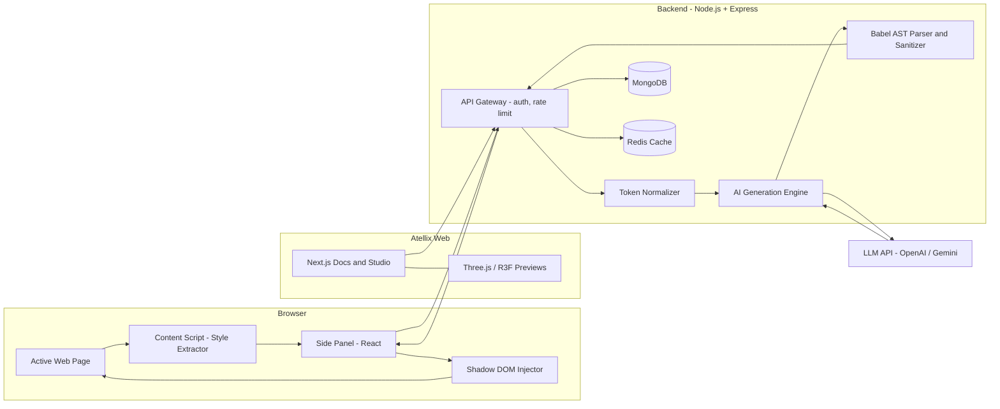
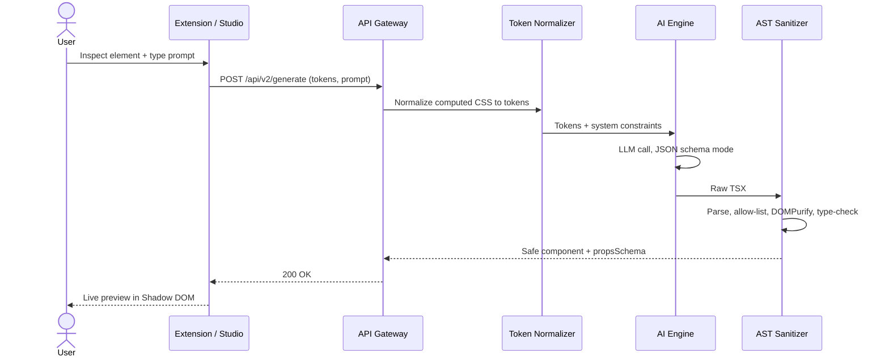
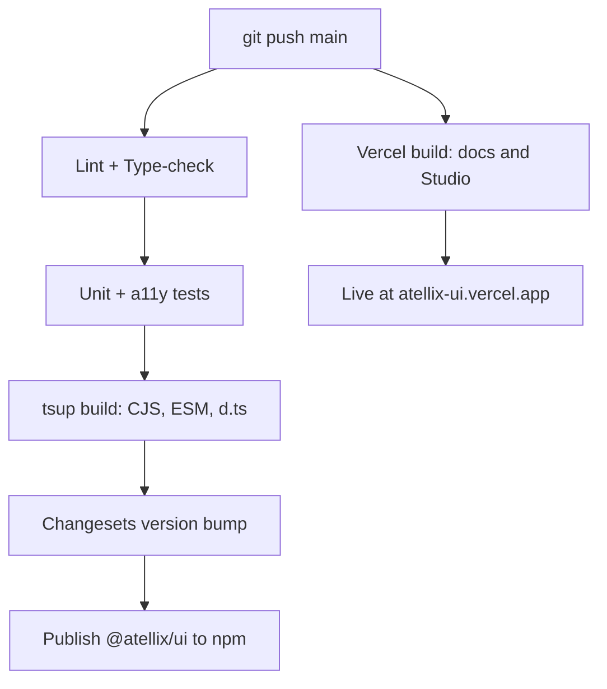
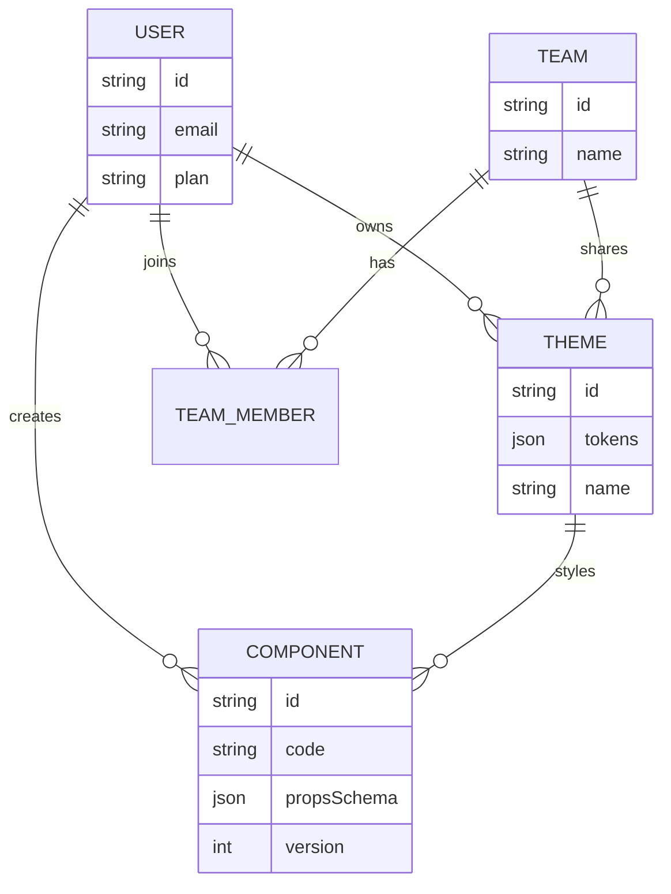
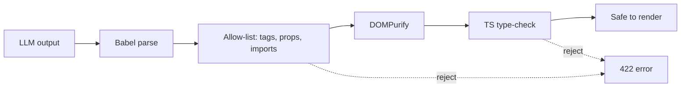
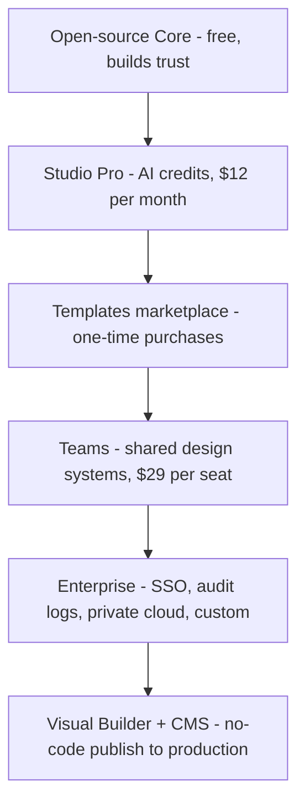
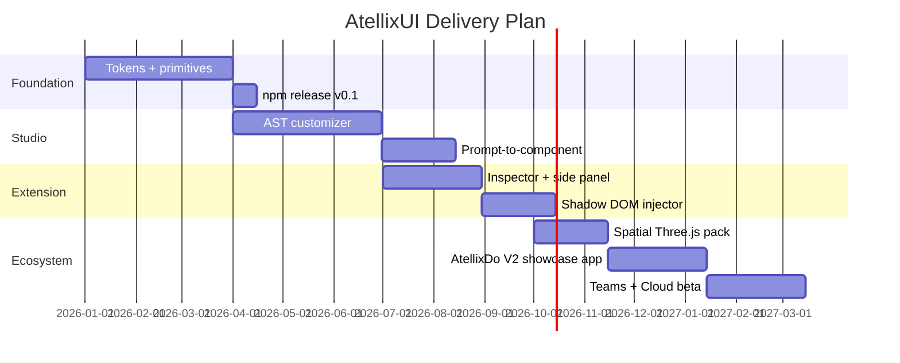

# AtellixUI — Product Requirements & Architecture Document (v2.0)

> **Tagline:** From component library to design-to-code ecosystem. **Status:** Draft for build · **Owner:** Founder / Lead Engineer · **Last updated:** Oct 2026

---

## 1. Executive Summary

AtellixUI is a dark-mode-first, accessible React component system that grows into an end-to-end **design-to-code platform**. It has four layers:

| Layer | Product               | Role                                                                                   |
| ----- | --------------------- | -------------------------------------------------------------------------------------- |
| 1     | **AtellixUI Core**    | Open-source headless primitives + design tokens (React, Tailwind, Framer Motion)       |
| 2     | **Atellix Studio**    | Visual customizer + AI prompt-to-component engine                                      |
| 3     | **Atellix Inspector** | Chrome extension (MV3): extract tokens from any site, preview components in Shadow DOM |
| 4     | **Atellix Cloud**     | Visual builder, team design systems, enterprise governance                             |

**Problem:** Static libraries (MUI, Chakra) are rigid; AI generators (v0-style tools) produce inconsistent, off-brand code. **Solution:** One token system powers components, the visual editor, the AI generator and the browser extension, so every output is on-brand, typed and accessible.

**Vision:** the "Figma + Vercel v0 + Webflow" of the React world, with spatial (3D) UI as a differentiator.

---

## 2. Goals, Non-Goals, Success Metrics

**Goals**

- Ship a core bundle under **12 kB gzipped** with WCAG 2.1 AA primitives.
- Prompt-to-component in **under 8 s** (p95) that passes lint, type-check and sanitization.
- 10,000 npm weekly downloads within 12 months of v1.0.

**Non-goals (v2.0):** Native mobile (React Native), Vue/Svelte ports, full Figma replacement.

| Metric                      | Target (12 mo) |
| --------------------------- | -------------- |
| npm weekly downloads        | 10,000         |
| GitHub stars                | 5,000          |
| Studio monthly active users | 3,000          |
| Free → Pro conversion       | 3–5%           |
| Lighthouse (docs site)      | 95+            |

---

## 3. Personas

| Persona                  | Need                         | Key feature                         |
| ------------------------ | ---------------------------- | ----------------------------------- |
| **Full-stack dev**       | Ship polished UI fast        | Copy-paste components, CLI          |
| **Design engineer**      | Pixel-perfect, animated UI   | Token editor, Framer Motion presets |
| **Startup founder**      | MVP in a weekend             | Prompt-to-UI, templates             |
| **Enterprise team lead** | Consistency across 100+ apps | Managed design system, audit logs   |

---

## 4. Functional Requirements

### 4.1 Core Library

1. **Dynamic design tokens** – CSS variables; runtime theme swap (Dark / Light / System / Brand) without full re-render.
2. **Accessible primitives** – keyboard navigation, ARIA, focus traps, built on unstyled headless roots.
3. **Micro-interactions** – spring physics (Framer Motion) for hover, sheet, toast, accordion layout.
4. **Spatial components (Three.js)** – `<SpatialHero>`, `<GlowOrb>`, `<ParallaxCardStack>` using React Three Fiber, lazy-loaded so core stays light.
5. **Export engine** – TSX, JSX, Tailwind v4 CSS, headless hooks.

### 4.2 Atellix Studio

1. **AST property manipulator** – panel edits radius, type, spacing, tokens → updates the Abstract Syntax Tree live.
2. **Prompt-to-component** – LLM constrained by the user's tokens; output validated by Babel AST + sanitizer.
3. **Version history & share links.**

### 4.3 Chrome Extension (MV3)

1. Hover-inspect any element → map computed styles to nearest Atellix tokens.
2. Side Panel sandbox using the extracted palette.
3. Shadow DOM live injector (`<atellix-shadow-root>`) for zero CSS leakage.

---

## 5. Non-Functional Requirements

| Area          | Requirement                                                                                              |
| ------------- | -------------------------------------------------------------------------------------------------------- |
| Performance   | Core \< 12 kB gz; AST edits re-render \< 100 ms; 3D modules lazy-loaded                                  |
| Reliability   | Shadow DOM isolation; API availability 99.9%                                                             |
| Security      | DOMPurify + AST allow-list on all AI output; MV3 CSP; no `eval`; rate limiting; secrets server-side only |
| Accessibility | WCAG 2.1 AA, tested with axe + manual screen-reader pass                                                 |
| Compatibility | React 18/19, Tailwind 3/4, Chrome / Edge / Brave                                                         |
| DX            | Fully typed, tree-shakeable, ESM + CJS                                                                   |

---

## 6. System Architecture

### 6.1 High-level architecture



### 6.2 Prompt-to-component sequence



### 6.3 Technology stack

| Layer       | Technology                               | Purpose                   |
| ----------- | ---------------------------------------- | ------------------------- |
| Language    | TypeScript 5+                            | Strict types              |
| UI          | React 18/19                              | Components                |
| Styling     | Tailwind 3/4 + CSS variables             | Tokens                    |
| Animation   | Framer Motion                            | Springs, layout, gestures |
| 3D          | Three.js + React Three Fiber + drei      | Spatial UI                |
| Class merge | clsx + tailwind-merge                    | Avoid class clashes       |
| Bundler     | tsup                                     | ESM/CJS + `.d.ts`         |
| Monorepo    | Turborepo + pnpm                         | Caching, linking          |
| Docs        | Next.js App Router + Shiki               | Live showcase             |
| Backend     | Node.js, Express, MongoDB, Redis         | API, storage, cache       |
| Testing     | Vitest, Testing Library, Playwright, axe | Unit, e2e, a11y           |
| CI/CD       | GitHub Actions + Vercel                  | Publish + deploy          |

### 6.4 Delivery pipeline



---

## 7. Repository & File Structure

```text
atellix/
├─ apps/
│  ├─ docs/                    # Next.js docs + Studio
│  │  ├─ app/
│  │  │  ├─ (marketing)/page.tsx
│  │  │  ├─ components/[slug]/page.tsx
│  │  │  └─ studio/page.tsx
│  │  └─ components/playground/ # live props controller
│  ├─ api/                     # Express backend
│  │  └─ src/
│  │     ├─ routes/generate.ts
│  │     ├─ services/{normalizer,aiEngine,sanitizer}.ts
│  │     ├─ models/{User,Theme,Component}.ts
│  │     └─ middleware/{auth,rateLimit}.ts
│  └─ extension/               # Chrome MV3
│     ├─ manifest.json
│     ├─ background.ts
│     ├─ contentScript.ts
│     ├─ sidepanel/            # React side panel
│     └─ injector/shadowRoot.ts
├─ packages/
│  ├─ ui/                      # @atellix/ui
│  │  └─ src/{primitives,spatial,tokens,hooks,utils}/
│  ├─ tokens/                  # design-token JSON + transformers
│  ├─ cli/                     # npx atellix add button
│  └─ config/                  # shared eslint, tsconfig, tailwind
├─ turbo.json
├─ pnpm-workspace.yaml
└─ .github/workflows/{ci,release}.yml
```

---

## 8. Data Contracts

### 8.1 `DomStylePayload` (extension → backend)

```json
{
  "sourceUrl": "https://example.com",
  "targetElement": "button",
  "styles": {
    "backgroundColor": "rgb(99,102,241)",
    "color": "rgb(255,255,255)",
    "fontFamily": "Inter, sans-serif",
    "fontSize": "14px",
    "padding": "8px 16px",
    "borderRadius": "8px",
    "boxShadow": "none"
  }
}
```

Required: `sourceUrl`, `targetElement`, `styles.backgroundColor`, `styles.color`, `styles.borderRadius`.

### 8.2 `POST /api/v2/generate`

```json
{
  "prompt": "Glassmorphic card with title, subtext and action button",
  "themeTokens": {
    "primaryColor": "#6366F1",
    "surfaceBg": "rgba(15,23,42,0.6)",
    "borderRadius": "0.75rem",
    "blurRatio": "12px"
  },
  "format": "tsx"
}
```

Response: `{ status, componentName, code, propsSchema[] }`. Errors: `400` invalid payload · `401` unauthenticated · `422` sanitizer rejected code · `429` rate limited.

### 8.3 Data model



---

## 9. Wireframes

### 9.1 Atellix Studio (web)

```text
┌────────────────────────────────────────────────────────────────────────┐
│ ◈ Atellix Studio     [Components] [Templates] [Docs]     (Avatar ▾)    │
├───────────────┬─────────────────────────────────┬──────────────────────┤
│ COMPONENTS    │  LIVE CANVAS                    │  PROPERTIES          │
│ ▸ Button      │  ┌───────────────────────────┐  │  Radius   [━━●━━] 12 │
│ ▸ Card        │  │      ┌───────────────┐    │  │  Padding  [━●━━━] 16 │
│ ▾ Glass Panel │  │      │  Glass Card   │    │  │  Font     [Inter ▾]  │
│ ▸ Accordion   │  │      │  [ Action ]   │    │  │  Primary  [■ #6366F1]│
│ ▸ Toast       │  │      └───────────────┘    │  │  Blur     [━━━●━] 12 │
│               │  └───────────────────────────┘  │  Theme [Dark|Light]  │
│               │  [Desktop] [Tablet] [Mobile]    │                      │
├───────────────┴─────────────────────────────────┴──────────────────────┤
│ ✦ Prompt: "Build a SaaS analytics dashboard in dark mode"   [Generate] │
├────────────────────────────────────────────────────────────────────────┤
│ CODE  [TSX|JSX|CSS]                                  [Copy] [Export]   │
└────────────────────────────────────────────────────────────────────────┘
```

### 9.2 Chrome Side Panel

```text
┌──────────────────────────┐
│ ◈ Atellix Inspector  [⚙] │
├──────────────────────────┤
│ [● Inspect mode ON]      │
│ Selected: <button>       │
│ ─ Extracted Tokens ─     │
│ bg      ■ #6366F1        │
│ text    ■ #FFFFFF        │
│ radius  8px  → rounded-lg│
│ shadow  none             │
├──────────────────────────┤
│ Prompt:                  │
│ ┌──────────────────────┐ │
│ │ Pricing card, 3 tiers│ │
│ └──────────────────────┘ │
│ [ Generate ]  [Inject ▸] │
├──────────────────────────┤
│ Preview (Shadow DOM)     │
│ ┌──────────────────────┐ │
│ │      component       │ │
│ └──────────────────────┘ │
│ [Copy TSX]  [Save]       │
└──────────────────────────┘
```

### 9.3 Spatial landing hero (Three.js)

```text
┌──────────────────────────────────────────────────────┐
│  ◈ Atellix        Docs  Studio  Pricing   [Get Started]│
│                                                      │
│        Build UI at the speed of thought.            │
│     ╭─────╮   ◯ floating glass panels                │
│     │ 3D  │   ◯ glowing orb follows cursor           │
│     ╰─────╯   ◯ parallax depth on scroll             │
│   [ Try Studio ]   [ npm i @atellix/ui ]             │
└──────────────────────────────────────────────────────┘
```

Rules: respect `prefers-reduced-motion`, cap DPR at 2, fall back to a static image when WebGL is unavailable.

---

## 10. Security & Privacy



- Block `dangerouslySetInnerHTML`, `eval`, dynamic imports, remote scripts.
- Extension requests the minimum permissions; `<all_urls>` is justified and documented; no page data is stored without user consent.
- Strict CSP, JWT with short expiry, per-user rate limits, audit logs for Enterprise.

---

## 11. Business Model & Scale Strategy



| Tier       | Price      | Includes                                  |
| ---------- | ---------- | ----------------------------------------- |
| Free       | $0         | Core library, 20 AI generations/mo        |
| Pro        | \~$12/mo   | Unlimited tokens, 500 generations, export |
| Team       | \~$29/seat | Shared themes, review flow                |
| Enterprise | Custom     | SSO, governance, SLA                      |

**Billion-dollar path (comparable: Vercel, Figma, Webflow):**

1. Win developers with open source (distribution).
2. Monetize AI generation on top of your own tokens (differentiation).
3. Add a visual builder so non-engineers publish (expand the market).
4. Sell managed design systems to enterprises (high contract value).

**Moat:** the token graph + usage data → better, on-brand generations over time.

---

## 12. Roadmap



**Portfolio sequence:** AtellixUI → AI Career Navigator (React Flow, Express, MongoDB) → Real-time collaborative code editor (Monaco, Yjs, Judge0).

---

## 13. Risks & Mitigations

| Risk                           | Impact | Mitigation                                             |
| ------------------------------ | ------ | ------------------------------------------------------ |
| LLM output unsafe/inconsistent | High   | AST allow-list, schema mode, tests on every generation |
| Big players copy idea          | Medium | Move fast, community, token-graph moat                 |
| 3D hurts performance           | Medium | Lazy load, reduced-motion, static fallback             |
| Chrome Web Store review delays | Medium | Minimal permissions, clear privacy policy              |
| Solo-founder bandwidth         | High   | Ship small, depth over features, automate CI           |
| AI API cost                    | Medium | Caching, quotas, smaller models for simple tasks       |

---

## 14. Definition of Done (per feature)

PRD updated → API contract written → typed → a11y checked (axe) → tested → documented with live demo → changeset added → shipped and announced publicly.

---

## 15. Execution Principles

1. **Document before coding** – PRD, diagram, API contract first.
2. **Depth over feature count** – fast, typed, accessible, resilient.
3. **Public execution** – push daily, write technical posts, share on X/LinkedIn.
