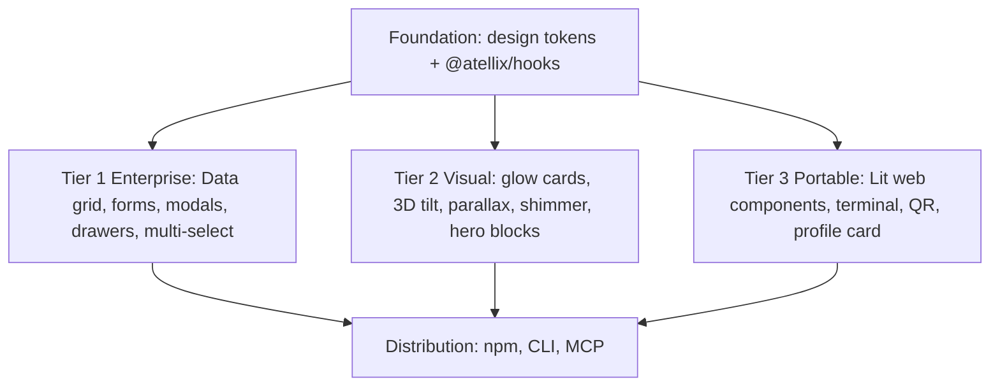
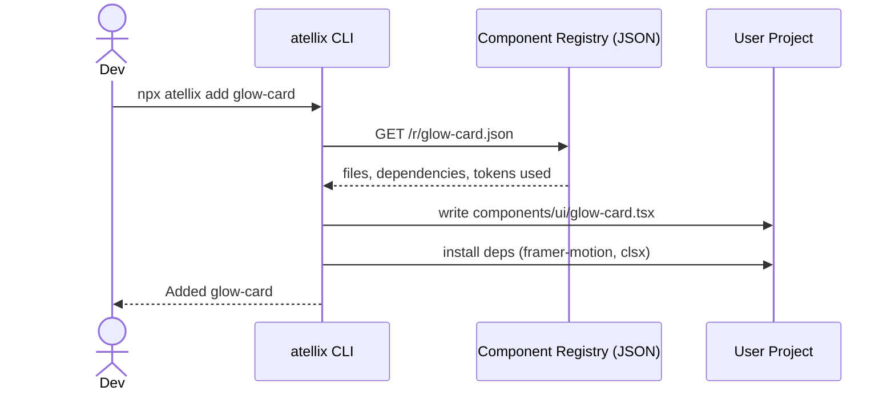
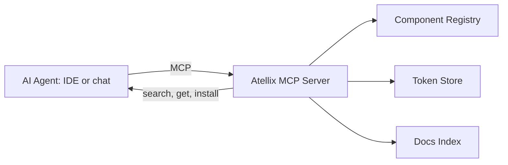
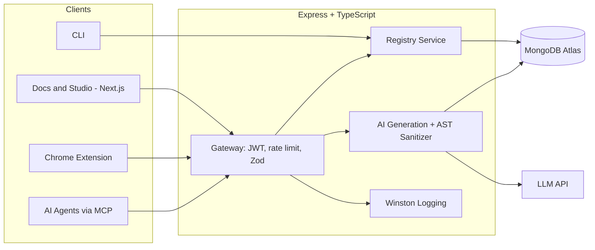
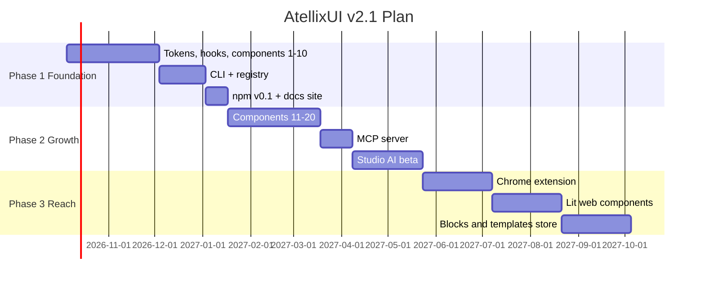

# AtellixUI — PRD v2.1

> **Supersedes:** v2.0 (sections on security, data contracts, wireframes and extension carry forward unchanged) **Theme of this release:** a sharper product identity, a copy-paste distribution model, and a realistic solo-founder build order.

---

## 1. What Changed from v2.0

| # | Change | Why |
| --- | --- | --- |
| 1 | Three-tier component spectrum (Enterprise, Visual, Portable) | Combines depth (Ant, Mantine) with visual appeal (Aceternity) and reach (BharatUI) |
| 2 | **Copy-paste distribution via `npx atellix add`** alongside the npm package | Users own the code; fastest path to adoption |
| 3 | **MCP server** for AI agents | AI tools can build with AtellixUI directly; feeds the Studio AI product |
| 4 | Single database (**MongoDB**) | Removes Prisma + PostgreSQL overhead for a solo build |
| 5 | `@atellix/hooks` package | Developer-experience benchmark from Mantine |
| 6 | Ranked first-20 component build order | Ship visible value early |
| 7 | Web Components (Lit) moved to Phase 3 | Valuable, but a separate toolchain |

---

## 2. Positioning

| Inspiration | Weight | What we adopt | What we do differently |
| --- | --- | --- | --- |
| BharatUI | High | Framework-agnostic portability, terminal widget, community identity | React-first, Lit export later |
| Aceternity UI | High | Copy-paste model, motion polish, free components + paid blocks, MCP | Token-driven theming and a live visual editor |
| Ant Design | Medium | Enterprise depth, token system, config provider | Lighter, Tailwind-native |
| Mantine | Medium | Hooks library, typed props, sensible defaults | Animation-first |
| MUI | Low | Accessibility and theming patterns only | No Material look |

**Positioning statement:** *AtellixUI is the token-driven, animation-first React component system with a built-in visual editor and AI generator, built so every output stays on-brand.*

---

## 3. Component Spectrum



| Tier | Inspired by | Release phase | Business role |
| --- | --- | --- | --- |
| Foundation | Mantine, Ant | Phase 1 | Trust and consistency |
| Tier 2 Visual | Aceternity | Phase 1 (first) | Growth and sharing |
| Tier 1 Enterprise | Ant, Mantine | Phase 2 | Credibility and paid teams |
| Tier 3 Portable | BharatUI | Phase 3 | Reach and community |

---

## 4. Distribution Model

### 4.1 CLI (`@atellix/cli`)

```bash
npx atellix init                 # creates atellix.json, installs tokens + utils
npx atellix add glow-card        # copies component source into your project
npx atellix add button modal     # multiple at once
npx atellix theme import ./brand.json
```



**Registry item schema**

```json
{
  "name": "glow-card",
  "tier": 2,
  "dependencies": ["framer-motion", "clsx", "tailwind-merge"],
  "files": [{ "path": "ui/glow-card.tsx", "content": "..." }],
  "tokens": ["--atx-primary", "--atx-radius"]
}
```

### 4.2 MCP Server (`@atellix/mcp`)



Tools exposed: `list_components`, `get_component(name)`, `get_tokens(theme)`, `search_docs(query)`, `generate_component(prompt)` (uses Studio engine; rate-limited).

---

## 5. Updated System Architecture



**Stack decision:** MongoDB only (Mongoose). Revisit PostgreSQL only when billing or relational reporting needs it.

| Concern | Choice |
| --- | --- |
| Validation | Zod on every route; shared schemas in `packages/schemas` |
| Auth | JWT in httpOnly cookies, bcrypt, CORS allow-list |
| Logging | Winston with request IDs |
| Docs rendering | Marked + Shiki (preferred over Highlight.js for accurate themes) |
| Icons | Lucide |

---

## 6. Monorepo Structure (updated)

```text
atellix/
├─ apps/
│  ├─ docs/                 # Next.js: docs, gallery, Studio
│  ├─ api/                  # Express: registry, generate, auth
│  └─ extension/            # Chrome MV3
├─ packages/
│  ├─ ui/                   # @atellix/ui (React components)
│  ├─ hooks/                # @atellix/hooks
│  ├─ tokens/               # token JSON + transformers
│  ├─ schemas/              # shared Zod schemas
│  ├─ cli/                  # @atellix/cli
│  ├─ mcp/                  # @atellix/mcp
│  ├─ registry/             # component JSON builder
│  ├─ web-components/       # Lit export (Phase 3)
│  └─ config/               # eslint, tsconfig, tailwind
├─ turbo.json
└─ pnpm-workspace.yaml
```

---

## 7. First 20 Components — Ranked Build Order

Effort: **S** = under 1 day · **M** = 1–3 days · **L** = 4+ days.

| # | Component | Tier | Effort | Reason |
| --- | --- | --- | --- | --- |
| 1 | Button (variants, shimmer) | 2 | S | Proves tokens + motion end to end |
| 2 | Glow Card | 2 | S | Highly shareable |
| 3 | Badge | 1 | S | Quick win, completes status UI |
| 4 | Avatar + Avatar Group | 1 | S | Used everywhere |
| 5 | Toggle / Switch | 1 | S | Teaches accessible primitives |
| 6 | Input + Textarea | 1 | S | Base for forms |
| 7 | Tooltip | 1 | M | Positioning logic practice |
| 8 | Accordion (animated layout) | 2 | M | Showcase of Framer layout animation |
| 9 | Modal / Dialog | 1 | M | Focus trap, scroll lock |
| 10 | Toast system | 1 | M | Queue + spring reveal |
| 11 | 3D Tilt Card | 2 | M | Signature visual |
| 12 | Hero Parallax Text | 2 | M | Landing-page appeal |
| 13 | Navbar + Floating Dock | 2 | M | Common block |
| 14 | Drawer / Sheet | 1 | M | Reuses modal logic |
| 15 | Tabs | 1 | M | Keyboard navigation |
| 16 | Select / Multi-select | 1 | L | Complex a11y |
| 17 | Terminal Widget | 3 | M | BharatUI-style identity piece |
| 18 | Spatial Hero (Three.js) | 2 | L | Brand differentiator, lazy-loaded |
| 19 | Form Builder (Zod-driven) | 1 | L | Enterprise credibility |
| 20 | Data Grid (sort, filter, paginate) | 1 | L | Last: hardest, highest value |

**Rule:** every component ships with (a) a11y check, (b) docs page with live props, (c) registry JSON, (d) token usage listed.

---

## 8. `@atellix/hooks` (Phase 1 set)

`useDisclosure` · `useDebounce` · `useClickOutside` · `useHotkeys` · `useMediaQuery` · `useCopyToClipboard` · `useReducedMotion`

---

## 9. Business Model Update

| Product | Free | Paid |
| --- | --- | --- |
| Components (Tier 1–3) | All core components, CLI, hooks | — |
| Blocks and Pages | A few samples | Hero, pricing, dashboard blocks, full landing pages |
| Templates | — | Next.js templates (one-time purchase) |
| Studio AI | 20 generations/mo | Pro: more generations, export, history |
| Teams | — | Shared themes, review flow, private registry |

**Rule:** never gate core primitives. Gate time-saving bundles (blocks, templates, AI volume).

---

## 10. Revised Roadmap



---

## 11. Success Metrics by Phase

| Phase | Metric | Target |
| --- | --- | --- |
| 1 | Components shipped with docs | 10 |
| 1 | GitHub stars | 500 |
| 2 | CLI installs/week | 1,000 |
| 2 | MCP server users | 200 |
| 3 | npm weekly downloads | 10,000 |
| 3 | Paid conversions | 3% |

---

## 12. Risks (additions)

| Risk | Mitigation |
| --- | --- |
| Looking like a copy of existing libraries | Original designs, token-driven editor and AI as differentiators; check each reference site's licence before reusing anything |
| Scope creep from three tiers | Strict build order in section 7; no Tier 3 until Phase 3 |
| Registry/CLI maintenance burden | Generate registry JSON automatically in CI |
| Free-tier AI abuse | Auth required, per-user quotas, caching |

---

## 13. Next Actions (this week)

1. Create the Turborepo + pnpm workspace skeleton.
2. Define the token file (`packages/tokens`) with dark mode first.
3. Build Button and Glow Card, publish the docs page.
4. Post a build-in-public update on LinkedIn/X.