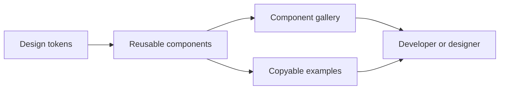

# AtellixUI

**A planned, reusable UI component library and interactive documentation site.**

> **Status:** Planned. This folder currently contains the project brief only; the existing Week-16 showcase is the reference implementation.

## Project Goal

AtellixUI will turn the visual experiments in the cohort into a consistent set of reusable interface components. Visitors should be able to explore component variants, preview responsive states, and copy working examples without treating a single static HTML page as a distributable library.

## Planned MVP

- Establish design tokens for color, type, spacing, borders, and focus states.
- Build reusable components with documented variants and interaction states.
- Start with buttons, form controls, cards, navigation, badges, and hero sections.
- Provide live previews and copyable examples in a searchable component gallery.
- Support keyboard navigation, visible focus, and responsive layouts.
- Add usage guidance, accessibility notes, and component tests.

## Planned Architecture

## Proposed Technology Stack

| Area                | Planned technology                                |
| ------------------- | ------------------------------------------------- |
| Component framework | React with TypeScript                             |
| Styling             | Tailwind CSS and documented design tokens         |
| Showcase site       | Vite                                              |
| Quality checks      | ESLint, component tests, and accessibility checks |

These choices are a proposed direction; the package and components have not yet been scaffolded here.

## Product Positioning

AtellixUI is intended for frontend developers and small teams who want a consistent, accessible starting point for React interfaces. The useful core is the component system and its documentation; AI is an optional authoring aid, not a substitute for tested components.

## Planned AI Assistance

- **Component drafting:** Describe a component and select its primitive and variants; receive a draft that follows the library's design tokens and component API.
- **Theme suggestions:** Generate proposed color or spacing variations from the existing token set and preview them before applying.
- **Accessibility review:** Summarize likely keyboard, labeling, contrast, and semantic issues for a selected component example.
- **Usage guidance:** Answer questions using AtellixUI's own component documentation and examples.

Generated code and design changes must be clearly labeled, editable, and reviewed before they enter the library. Validate drafts with type checks, linting, component tests, and accessibility checks; never execute generated code directly in a privileged environment.

## Product Launch Path

1. Build and document a small, cohesive set of reliable components without AI.
2. Publish the interactive gallery with responsive previews, copyable examples, accessibility notes, and versioned releases.
3. Invite a small developer group to test the API, documentation, and component coverage.
4. Add opt-in AI drafting constrained to approved components and design tokens, with usage limits and a non-AI workflow.
5. Launch with a live demo, installation guide, changelog, contribution guidelines, license, and clear support policy.

## Starting Point

[Week-16's UI Component Library](../../Week-16/UI%20Component%20library/Readme.md) contains the static Tailwind showcase that inspired AtellixUI. Its [current preview](../../Week-16/UI%20Component%20library/dist/index.html) includes examples such as a navbar, hero section, cards, buttons, and a theme-reveal slider.

## Milestones

- [ ] Define the visual language and component API conventions.
- [ ] Scaffold the library and showcase app.
- [ ] Implement the first documented, accessible components.
- [ ] Add previews, examples, tests, and usage documentation.
- [ ] Publish screenshots, a live showcase, and release instructions.

AtellixUI will move from planned to active once the first reusable components and showcase are implemented in this folder.
