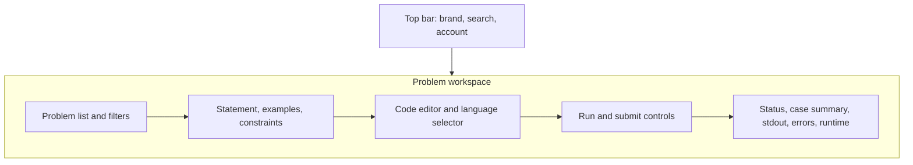
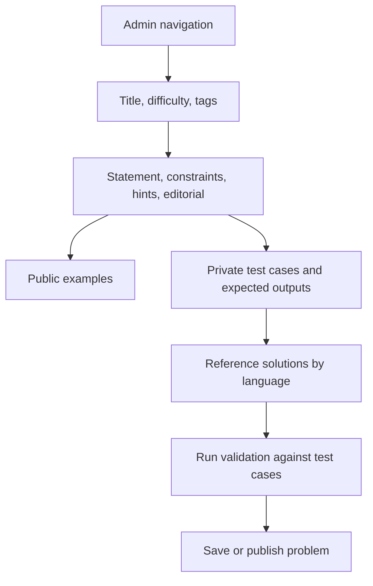
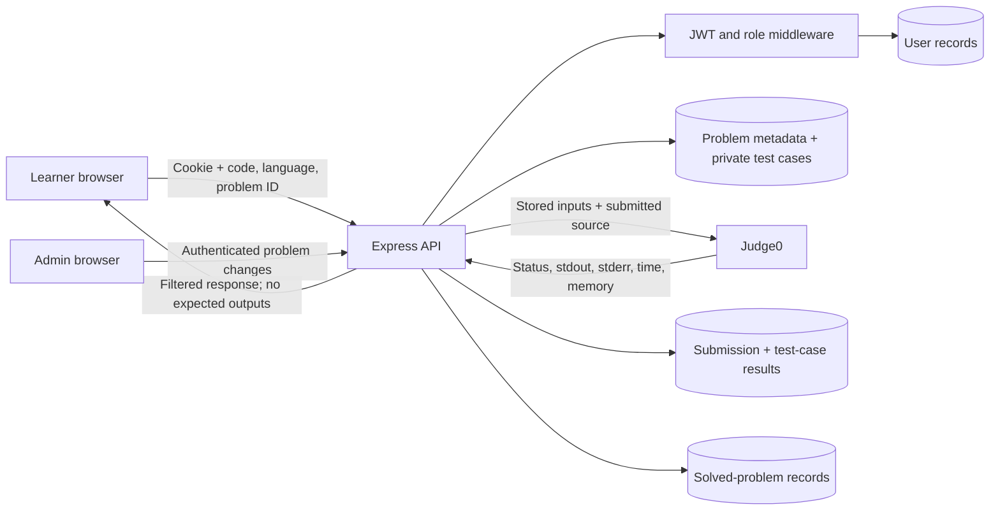
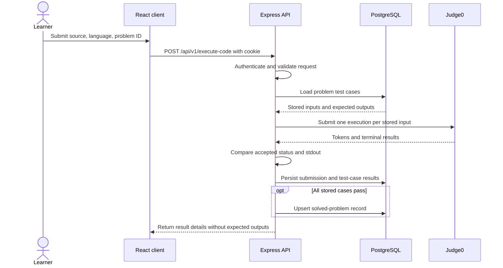

# LeetLab Product Requirements Document

| Field           | Value                                        |
| --------------- | -------------------------------------------- |
| Product         | LeetLab                                      |
| Document status | Draft for the current learning-project scope |
| Owner           | Uditya Pal                                   |
| Last updated    | 2026-09-30                                   |
| Related docs    | [Project README](./Readme.md)                |

## 1. Product Summary

LeetLab is a web application for practicing programming problems. Learners browse problems, write and submit solutions, inspect execution feedback, track solved problems, and organize study plans with playlists. Administrators manage problem content and its test cases.

The current repository contains a React/Vite frontend and an Express/Prisma/PostgreSQL backend with Judge0 integration. This PRD describes intended product behavior; it does not claim that every screen, workflow, deployment, or operational control is complete.

## 2. Problem Statement

Learners often split coding practice across problem lists, local editors, execution tools, and personal notes. LeetLab aims to bring problem discovery, code execution, feedback, and progress tracking into one authenticated workflow.

## 3. Users and Needs

### Learner

- Find a problem by title, difficulty, or tag.
- Read the statement and examples, choose a supported language, and submit code.
- Understand whether execution passed, failed, or encountered a compile/runtime problem.
- Review previous attempts and organize problems into personal playlists.

### Administrator

- Create and maintain problem statements, examples, tags, snippets, and reference solutions.
- Add public examples and private grading test cases.
- Ensure a problem's reference solution passes its configured test cases before publication.

## 4. Goals and Non-Goals

### Goals

- Provide a coherent browse → solve → execute → review loop.
- Keep authentication and administrative problem mutations behind server-side authorization.
- Grade against server-owned test cases; never trust expected outputs supplied by the browser.
- Preserve a user's submission history and solved-problem state.
- Make provider failures and execution outcomes understandable to users.

### Non-Goals for the Initial Release

- Hosting an execution sandbox: Judge0 remains an external dependency.
- Multiplayer contests, social feeds, paid subscriptions, or native mobile apps.
- AI-generated solutions or automatic code changes.
- Claiming production readiness before security, reliability, and deployment checks are complete.

## 5. Product Scope and Requirements

Priorities: **P0** is required for a usable initial release; **P1** follows after the core loop works reliably.

| ID       | Priority | Requirement                                            | Acceptance criteria                                                                                                                      |
| -------- | -------- | ------------------------------------------------------ | ---------------------------------------------------------------------------------------------------------------------------------------- |
| AUTH-01  | P0       | Register and log in using an HTTP-only session cookie. | Invalid credentials are rejected; successful auth returns a safe user profile; password values are never rendered or logged.             |
| AUTH-02  | P0       | Restore the current session and log out.               | Refreshing the browser restores a valid session; logout clears the cookie and protected routes become inaccessible.                      |
| PROB-01  | P0       | Browse and open problems.                              | Authenticated learners can see problem metadata and statements without receiving private test cases, reference solutions, or editorials. |
| EXEC-01  | P0       | Submit source code for a problem and language.         | The server loads test inputs and expected outputs from the database; clients cannot choose the grading cases.                            |
| EXEC-02  | P0       | Show execution feedback.                               | Each case reports an accurate terminal status and output; compilation/runtime/provider errors are not represented as accepted.           |
| EXEC-03  | P0       | Handle Judge0 failures.                                | Requests have timeouts; provider outages return a service error and do not create a fake accepted result.                                |
| PROG-01  | P0       | Save submissions and solved status.                    | A submission is persisted with its case results; a problem is marked solved only when all stored cases pass.                             |
| ADMIN-01 | P0       | Manage problems as an administrator.                   | Create, update, and delete routes enforce server-side admin checks; reference solutions are validated against configured test cases.     |
| PLAY-01  | P1       | Organize problems in playlists.                        | Users can create playlists, add/remove problems, and access only their own playlists.                                                    |
| HIST-01  | P1       | Review past attempts.                                  | A user can see their own submissions and per-problem attempt history, not another user's source code or records.                         |
| UX-01    | P1       | Provide usable loading, empty, and error states.       | Network/provider failures and empty lists have clear recovery paths and do not leave controls stuck.                                     |

## 6. Core User Flows

### Solve a Problem

1. Learner signs in and opens the problem list.
2. Learner opens a problem and reads its statement and public examples.
3. Learner selects a supported language, edits code, and submits.
4. API authenticates the request, loads stored test cases, and sends a batch to Judge0.
5. API compares terminal statuses and outputs, persists results, and updates solved status only when all cases pass.
6. UI shows the outcome and makes the attempt available in submission history.

### Create a Problem

1. Administrator signs in and opens the problem editor.
2. Administrator enters metadata, statement, examples, private test cases, snippets, and reference solutions.
3. API validates the request and checks reference solutions against configured cases.
4. API saves the problem only after validation succeeds.

## 7. Wireframes

These are structural wireframes for the intended information hierarchy, not screenshots of completed UI.

### Learner Workspace

### Admin Problem Editor

## 8. Data Flow and Trust Boundaries

Private tests, expected outputs, and reference solutions are trusted server data. The browser must not supply grading expectations or receive hidden solution material.

## 9. Code Execution Sequence

## 10. Success Measures

Establish baselines during a small pilot before setting firm targets:

- Percentage of new users who reach their first code execution.
- Percentage of execution requests that reach a valid terminal result.
- Median time from submission to visible result, reported separately from Judge0 provider outages.
- Percentage of users who return to attempt another problem within seven days.
- Number of test-case, privacy, and authorization defects found in release testing.

Do not optimize acceptance rate by weakening grading correctness or exposing hidden tests.

## 11. Non-Functional Requirements

- **Security:** Hash passwords; use HTTP-only cookies; validate authentication and roles server-side; keep secrets out of source control; do not expose private test data.
- **Execution safety:** Run untrusted source only through an isolated execution provider; set request/poll timeouts and resource limits at the provider boundary.
- **Reliability:** Return explicit errors for provider, database, and validation failures; never convert an infrastructure error into an accepted solution.
- **Privacy:** Return only the signed-in user's submission records; avoid logging passwords, cookies, source code, or provider credentials.
- **Accessibility:** Support keyboard operation, visible focus, semantic labels, and readable execution states.
- **Maintainability:** Validate API payloads, test critical auth/execution paths, and document environment setup and schema migrations.

## 12. Dependencies, Risks, and Open Questions

- Judge0 availability, quotas, language IDs, and response behavior are external dependencies.
- PostgreSQL connectivity and migration setup are required for persistence.
- Code execution must remain isolated; this application must not execute submitted source directly in the API process.
- Confirm which languages are supported in the UI and API; keep both lists synchronized.
- Confirm which problem fields are public, admin-only, or intentionally omitted from learner responses.
- Deployment URLs, production cookie domains, CORS policy, backups, and operational monitoring remain to be defined.

## 13. Release Acceptance Checklist

- [ ] A new user can register, log in, refresh the session, and log out.
- [ ] A learner can browse a problem and cannot retrieve private test cases or reference solutions.
- [ ] A submitted solution is judged against database-owned cases and shows truthful results.
- [ ] A Judge0 outage or timeout fails visibly without fabricating accepted status.
- [ ] Only administrators can mutate problem content.
- [ ] Submissions and solved status are persisted and scoped to the correct user.
- [ ] Backend tests, frontend lint, and production build pass in CI.
- [ ] Setup, environment variables, screenshots, deployment status, and known limitations are documented.
