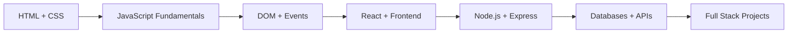
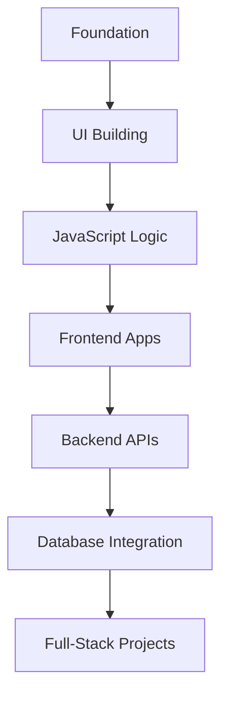
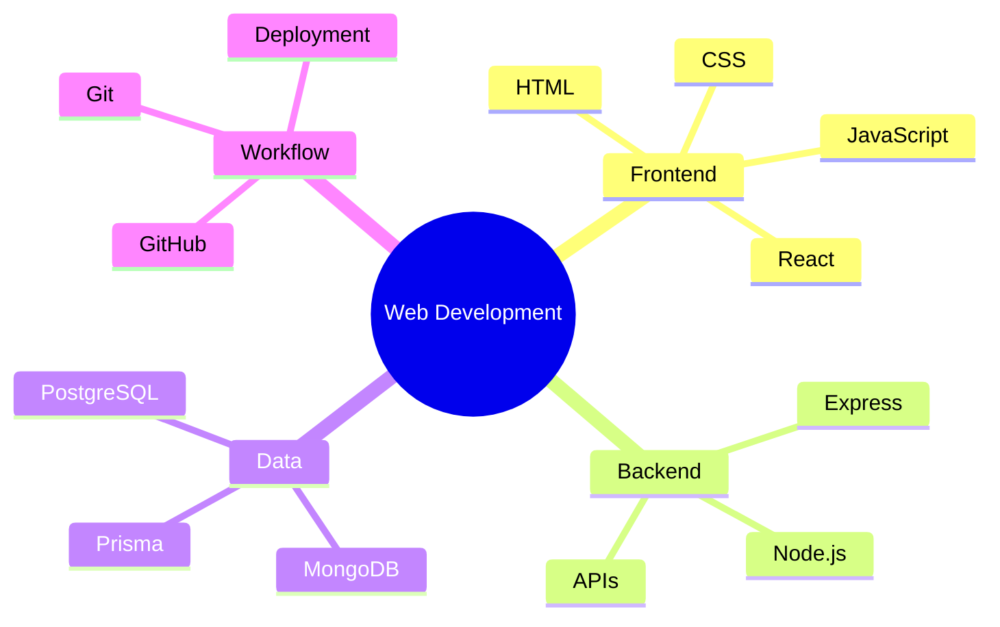

<div align="center">
  

  <a href="https://github.com/Uditya-Pal-1/Chai-Aur-Code-Cohort">
    
  </a>

  <br />

  <div align="center" dir="auto">
    <a href="https://x.com/Aman_Pal_1"></a>
    <a href="https://www.linkedin.com/in/udityapal"></a>
    <a href="mailto:udityapal2024@gmail.com"></a>
    <a href="https://conventionalcommits.org"></a>
    <a href="https://opensource.org/licenses/MIT"></a>
  </div>

  <p align="center">
    <a href="#overview">Overview</a> •
    <a href="#repository-map">Repository Map</a> •
    <a href="#featured-projects">Featured Projects</a> •
    <a href="#tech-stack">Tech Stack</a>
  </p>
</div>

# Chai Aur Code Cohort

A structured learning repository documenting my journey through Hitesh Choudhary Sir's Chai aur Code Web Development Cohort 1.0.

This repository captures my progression from foundational web technologies to full-stack application development through assignments, practice exercises, mini-projects, and hands-on implementation work.

---

## Overview

This repository is organized as a complete learning archive and includes work across:

- HTML, CSS, and JavaScript fundamentals
- DOM manipulation and browser APIs
- frontend development with React
- backend development using Node.js and Express
- API design and data persistence
- full-stack project implementation and experimentation

The goal of this repository is to reflect both the learning process and the practical application of concepts in real projects.

---

## Repository Map

```text
Chai-Aur-Code-Cohort/
├── README.md
├── Blogs/                           → notes, articles, and learning writeups
├── Projects/                        → bigger product-style builds and case studies
│   ├── README.md
│   ├── leetLab/                     → major full-stack project
│   └── MasterJI/
├── Week-00/                         → setup and basics
├── Week-01/                         → HTML/CSS learning
├── Week-02/                         → DOM and browser fundamentals
├── Week-03/                         → challenge-based CSS work
├── Week-04/                         → JavaScript logic and interaction
├── Week-05/                         → loops and practical JS
├── Week-06/                         → functions and problem solving
├── Week-07/                         → advanced JavaScript concepts
├── Week-08/                         → DOM + event handling + mini projects
├── Week-09/                         → JS practice and progression
├── Week-10/                         → async concepts and project work
├── Week-11/                         → closures, machine coding, mini projects
├── Week-12/                         → projects and DOM tasks
├── Week-13/                         → DOM challenges and JS practice
├── Week-14/                         → challenge work and project growth
├── Week-15/                         → full-stack project work
├── Week-16/                         → Node.js, backend, and server concepts
├── Week-17/                         → structured backend architecture
├── Week-18/                         → TypeScript and database work
├── Week-19/                         → React and full-stack applications
├── Week-20/                         → final learning and polish
├── CONTRIBUTING.md
├── LICENSE
├── package.json
├── .gitignore
├── pnpm-lock.yaml
└── pnpm-workspace.yaml
```

> Each week is linked to a distinct learning objective, creating a clear progression from fundamentals to advanced application-building.

---

## Learning Journey



This progression reflects the typical path of a modern web developer: build fundamentals first, then move into interactivity, frameworks, backend systems, and finally full-stack product development.

### Skills Growth Diagram



### Learning Stack Diagram



---

## Featured Projects

| Project / Area                       | Type                   | Focus                                                        | Status    |
| ------------------------------------ | ---------------------- | ------------------------------------------------------------ | --------- |
| [Projects/leetLab](Projects/leetLab) | Full-stack application | coding platform, auth, execution engine, submission workflow | Active    |
| [Week-08](Week-08)                   | Learning module        | DOM, events, JavaScript fundamentals                         | Completed |
| [Week-15](Week-15)                   | Practice project       | full-stack app building                                      | Completed |
| [Week-17](Week-17)                   | Backend module         | Express APIs, architecture, structured backend work          | Completed |
| [Week-19](Week-19)                   | React + app work       | frontend patterns and application development                | Completed |

### LeetLab

A full-stack coding platform inspired by competitive programming and interview preparation tools.

- Frontend: React + Vite
- Backend: Node.js + Express
- Database: PostgreSQL / Prisma
- Core features: authentication, problem creation, execution, result tracking, playlist management

See: [Projects/README.md](Projects/README.md) and [Projects/leetLab](Projects/leetLab)

### Weekly Practice Modules

The week-by-week folders document the daily exercises and conceptual learning that supported the project work in this repository.

Examples:

- [Week-08](Week-08)
- [Week-15](Week-15)
- [Week-17](Week-17)
- [Week-19](Week-19)

### Quick Access by Week

- [Week-00](Week-00)
- [Week-01](Week-01)
- [Week-02](Week-02)
- [Week-03](Week-03)
- [Week-04](Week-04)
- [Week-05](Week-05)
- [Week-06](Week-06)
- [Week-07](Week-07)
- [Week-08](Week-08)
- [Week-09](Week-09)
- [Week-10](Week-10)
- [Week-11](Week-11)
- [Week-12](Week-12)
- [Week-13](Week-13)
- [Week-14](Week-14)
- [Week-15](Week-15)
- [Week-16](Week-16)
- [Week-17](Week-17)
- [Week-18](Week-18)
- [Week-19](Week-19)
- [Week-20](Week-20)

### Writing and Notes

This repository also includes learning notes and written reflections that help connect theory with implementation.

- [Blogs/README.md](Blogs/README.md)

---

## Tech Stack

- HTML5
- CSS3
- JavaScript
- React
- Node.js
- Express
- MongoDB / PostgreSQL
- Prisma
- Git / GitHub

---

## Highlights

- Week-by-week structured learning progression
- strong focus on frontend fundamentals and DOM understanding
- backend API and database integration practice
- full-stack project work and practical experimentation
- continuous learning from foundational concepts to application-level development

---

## Folder Highlights

| Folder               | Purpose                               |
| -------------------- | ------------------------------------- |
| [Week-00](Week-00)   | Orientation and setup                 |
| [Week-01](Week-01)   | HTML and CSS fundamentals             |
| [Week-02](Week-02)   | DOM and browser behavior              |
| [Week-03](Week-03)   | challenge-based CSS work              |
| [Week-04](Week-04)   | JavaScript logic and DOM interactions |
| [Week-05](Week-05)   | loops and practical JavaScript tasks  |
| [Week-06](Week-06)   | functions and problem solving         |
| [Week-07](Week-07)   | advanced JavaScript concepts          |
| [Week-08](Week-08)   | DOM, events, and frontend interaction |
| [Week-15](Week-15)   | full-stack project work               |
| [Week-16](Week-16)   | backend and server-side learning      |
| [Week-17](Week-17)   | structured backend architecture       |
| [Week-18](Week-18)   | TypeScript and database-focused work  |
| [Week-19](Week-19)   | React and application practice        |
| [Projects](Projects) | portfolio and product-style builds    |
| [Blogs](Blogs)       | notes and learning documentation      |

---

## How to Explore

### Clone the repository

```bash
git clone https://github.com/Uditya-Pal-1/Chai-Aur-Code-Cohort.git
cd Chai-Aur-Code-Cohort
```

### Open weekly work

```bash
cd Week-08
```

Choose a week directly from the links above, or open a specific folder such as:

- [Week-08](Week-08)
- [Week-15](Week-15)
- [Week-17](Week-17)
- [Week-19](Week-19)

### Open project work

```bash
cd Projects
ls
```

Major project links:

- [Projects/README.md](Projects/README.md)
- [Projects/leetLab](Projects/leetLab)
- [Projects/leetLab/frontend](Projects/leetLab/frontend)
- [Projects/leetLab/backend](Projects/leetLab/backend)

---

## Current Focus

This repository reflects an active learning journey in modern web development and demonstrates steady progress across frontend, backend, and project-building work.

The next step is to refine the strongest material into a more curated portfolio presentation with:

- live demo links
- project screenshots
- clearer project summaries
- architecture diagrams
- deployment-ready documentation

---

## Contributing

Contributions, feedback, and suggestions are welcome.

See [CONTRIBUTING.md](CONTRIBUTING.md) for details.

---

## License

This project is licensed under the [MIT License](LICENSE).

---

## Final Note

This repository represents continuous growth from beginner-level web development to a more advanced understanding of frontend, backend, and full-stack engineering concepts. It serves as both a learning archive and a practical record of my development journey.
