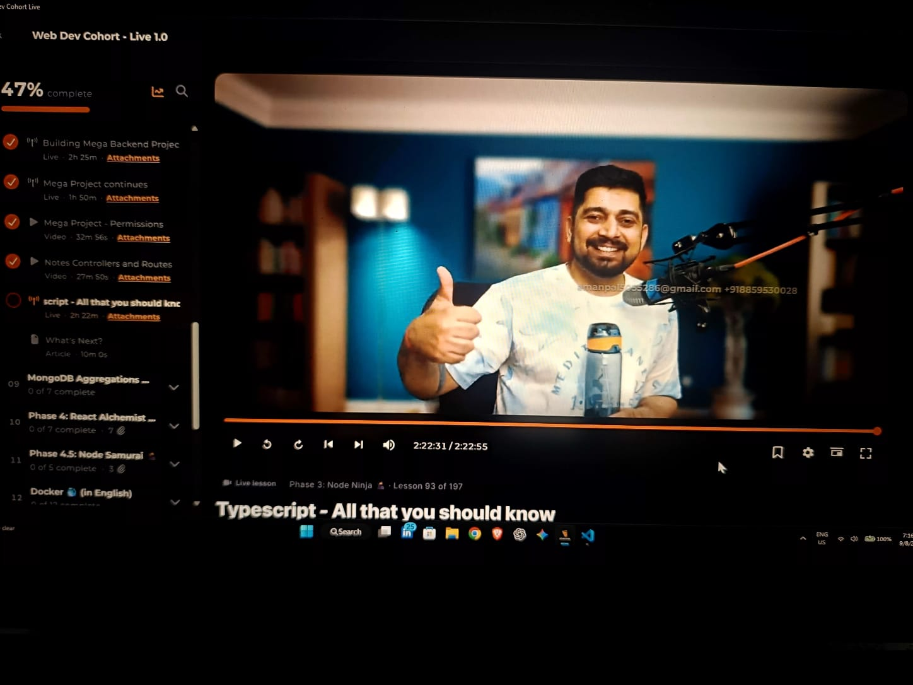
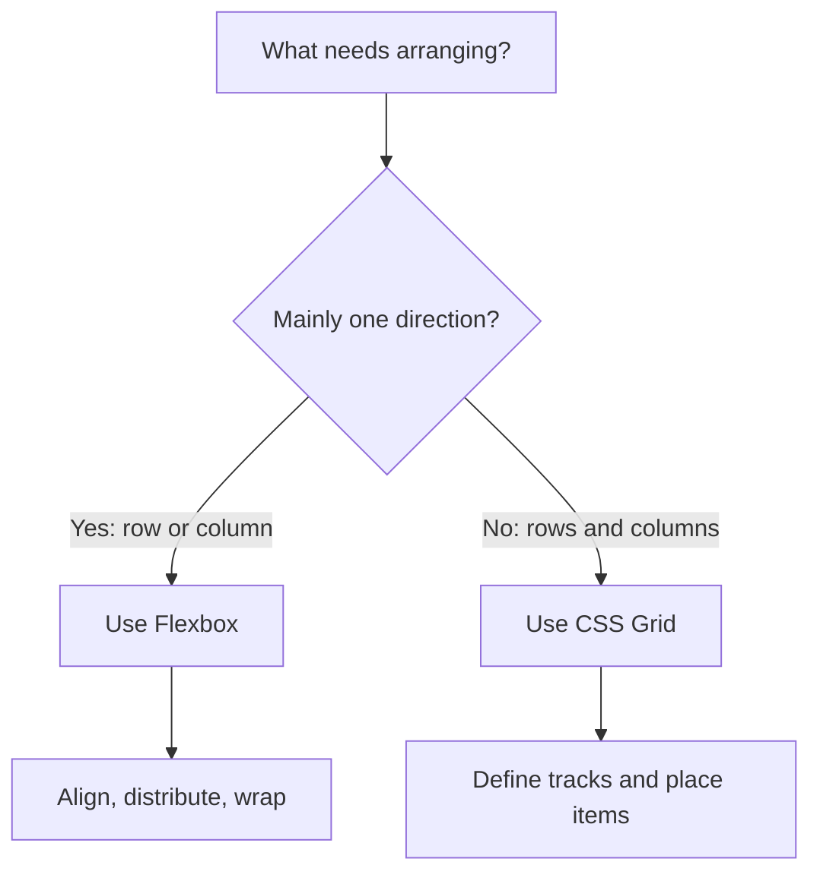
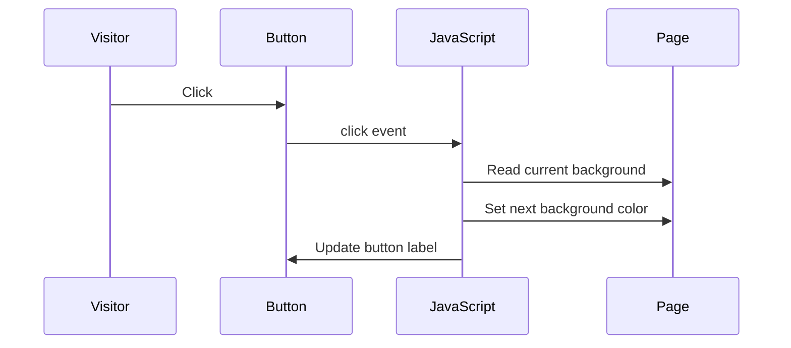

<div>
<h1 align="center">Week-02</h1>
<p align="center">Showcase of my journey to building a solid Foundation.</p>
</br>
<div align="center">
  
</div>

---
</hr>
</div>
<div align="center">

# Week 02: Layouts That Move, Pages That Respond

**Explore Flexbox, CSS Grid, and the DOM through small, hands-on web exercises.**

[](https://x.com/Aman_Pal_1)
[](https://www.linkedin.com/in/udityapal)
[](mailto:udityapal2024@gmail.com)

</div>

## The story of this week

A page can have all the right content and still feel unfinished: the items refuse to line up, the layout breaks when the screen changes, and the button just sits there. This week follows that page as it starts to come together. Flexbox arranges items along an axis, Grid gives the page a row-and-column structure, and JavaScript listens for a click and changes what the visitor sees.

The aim is not to memorize a list of properties. It is to look at the layout or interaction you want, choose a tool that fits, and test the result in the browser.

## What you'll explore

- How Flexbox distributes and aligns items in a container.
- How CSS Grid defines rows, columns, and cells.
- How the DOM represents a document as elements JavaScript can select and update.
- How a click event can trigger a visible page change.
- How HTML, CSS, and JavaScript work together in a small interactive example.

## Choose a layout tool

Flexbox and Grid both arrange content, but they are most comfortable with different kinds of problems. Flexbox is useful when the main concern is a row or column of items. Grid is useful when the layout needs both rows and columns.



### Flexbox: arrange items along an axis

The [`css-flexbox`](./css-flexbox/) exercise places child elements inside a flex container. Its stylesheet uses properties such as `gap`, `flex-wrap`, `justify-content`, and `align-items` to control spacing, wrapping, and alignment.

- [Open the Flexbox example](./css-flexbox/index.html)
- [View its stylesheet](./css-flexbox/style.css)

Try changing the container's `gap`, toggling `flex-wrap`, and adjusting `justify-content`. Watch how the items move when the available space changes.

### CSS Grid: build with rows and columns

The [`css-grid`](./css-grid/) exercises create a grid container with explicit row and column tracks. Start with [the first Grid example](./css-grid/index.html), then compare the numbered examples to explore different arrangements.

- [Grid example 2](./css-grid/index-2.html)
- [Grid example 3](./css-grid/index-3.html)
- [Grid example 4](./css-grid/index-4.html)
- [Grid example 5](./css-grid/index-5.html)
- [Grid example 6](./css-grid/index-6.html)
- [Grid example 7](./css-grid/index-7.html)
- [Grid example 8](./css-grid/index-8.html)

In the starter example, inspect `grid-template-rows` and `grid-template-columns`. Change the track sizes or the number of columns and observe how the cells are laid out.

### DOM: make the page respond

The [`dom-01`](./dom-01/) exercise connects a button in HTML to a JavaScript event listener. When the button is clicked, the script reads the current background, changes the page color, and updates the button label.

- [Open the DOM example](./dom-01/index.html)
- [Read the JavaScript](./dom-01/index.js)



The important steps are: select an element, listen for an event, then update the document in response.

## A small practice loop

1. Open an example in your browser.
2. Predict what one CSS or JavaScript change will do.
3. Edit the corresponding file and refresh the page.
4. Compare the result with your prediction.
5. Keep the change that teaches you something, or undo it and try another.

Ideas to try:

- Add more children to the Flexbox container and see when they wrap.
- Change the Grid to use a different number of columns.
- Update the DOM example so the button label always describes the next mode.
- Use your browser's developer tools to inspect the container and its children.

## Run the examples

These exercises use plain HTML, CSS, and JavaScript; no package installation or build step is required. Open an `.html` file directly in a browser, or use the VS Code Live Server extension if it is installed.

## Folder map

```text
Week-02/
├── 01-chaicode.html       # HTML content and heading practice
├── css-flexbox/           # Flex container and item alignment
├── css-grid/              # Grid rows, columns, and layout examples
├── dom-01/                # Button click and page background toggle
└── README.md              # Learning guide and exercise links
```

## Keep building

Once these examples make sense, try combining the ideas: use Grid for the overall page, Flexbox for a row of controls, and a small DOM event to let a user change the interface. That is the step from arranging elements to shaping an experience.

For contribution guidelines, see the repository's [CONTRIBUTING.md](../CONTRIBUTING.md). For licensing details, see the [LICENSE](../LICENSE).
