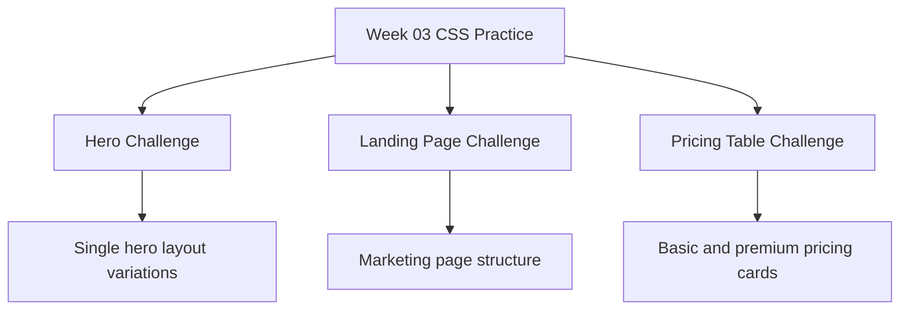
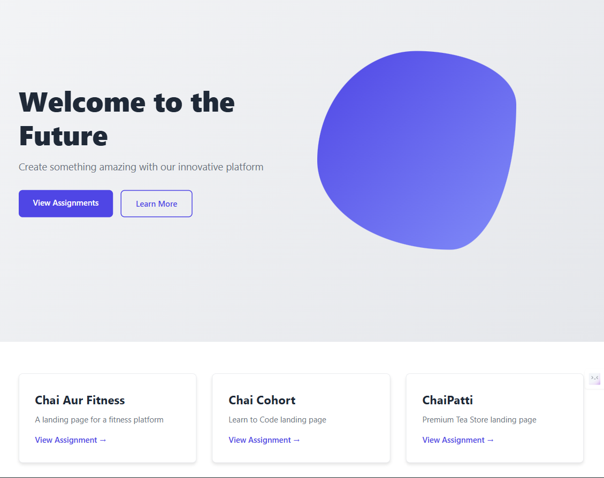
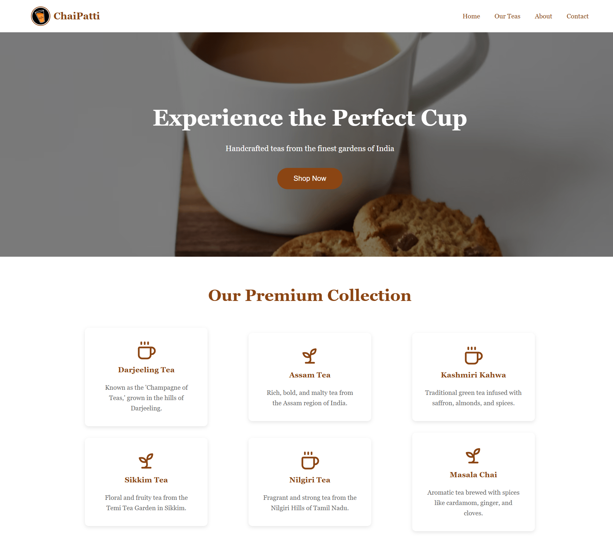
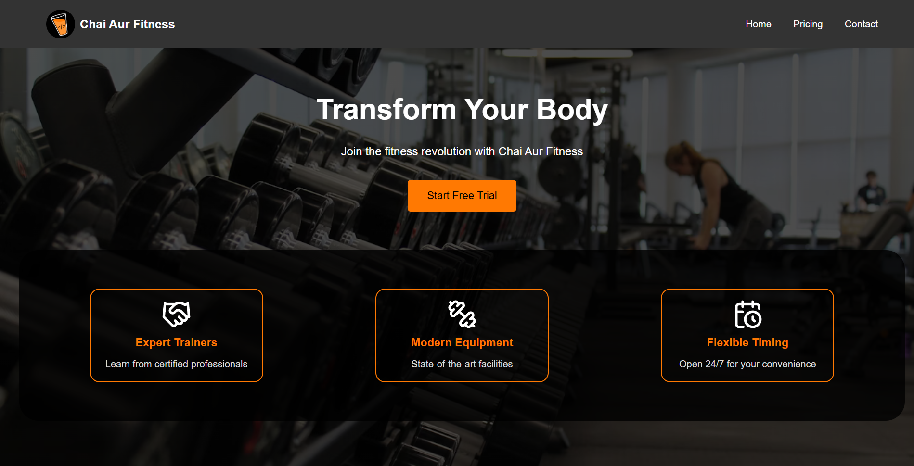
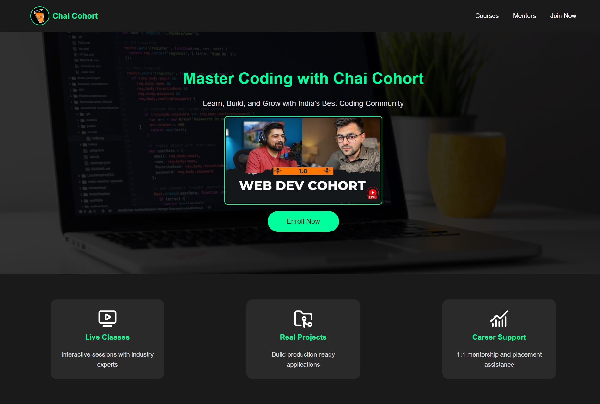
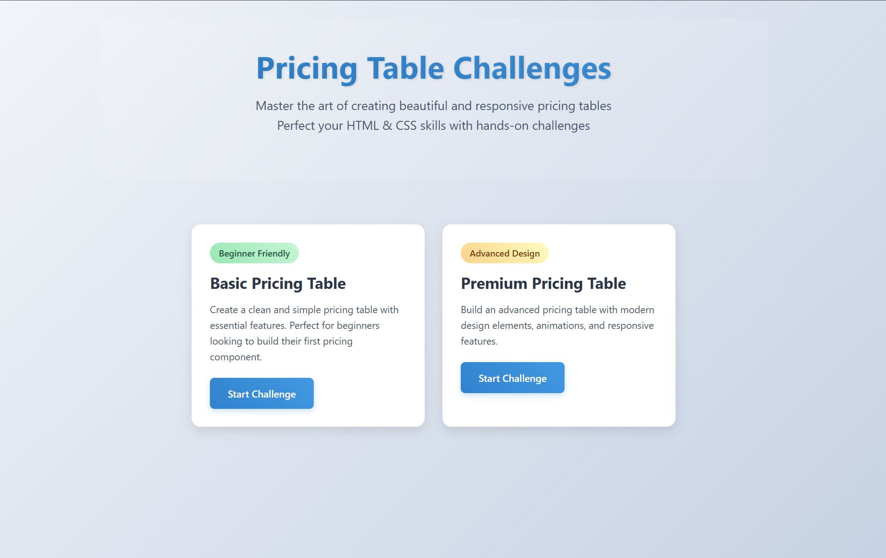
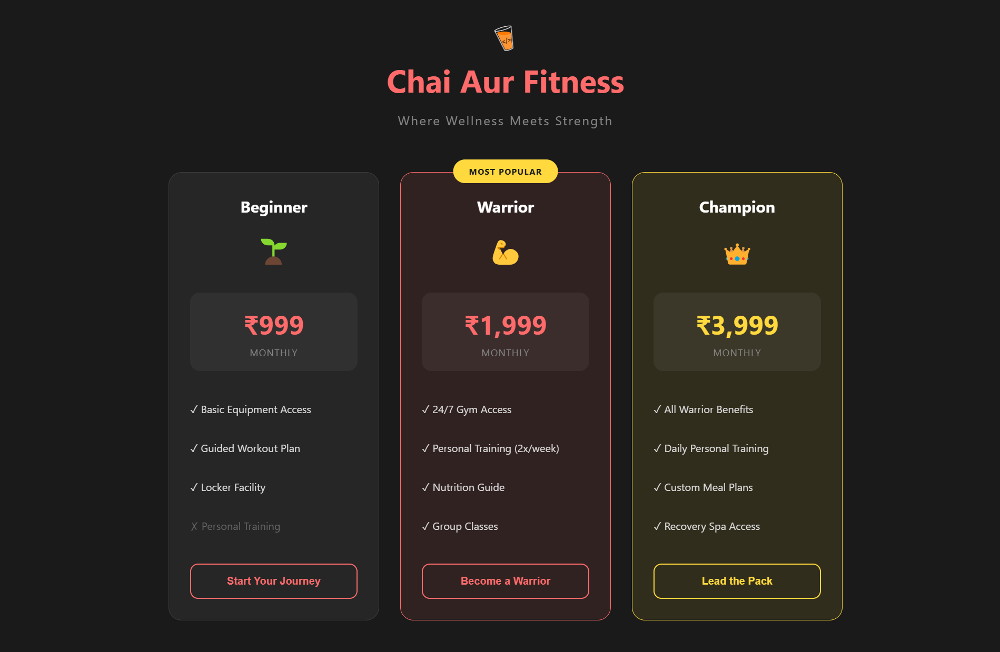
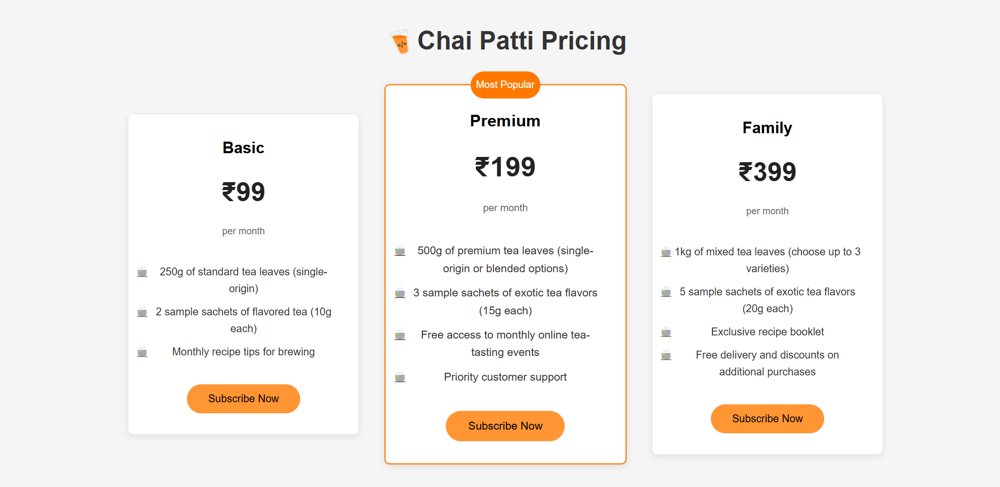
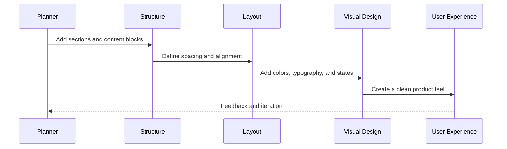

<div align="center">

# Week 03: CSS Challenges and Real-World UI Practice

**From raw HTML to polished product sections, from hero blocks to pricing cards.**

[](https://x.com/Aman_Pal_1)
[](https://www.linkedin.com/in/udityapal)
[](mailto:udityapal2024@gmail.com)

</div>

## The story behind this week

This week is where the ideas from earlier weeks finally begin to look like real products. A blank page turns into a structured layout. A few sections become a marketing page. A simple card grid becomes a pricing table. The goal is not only to write CSS, but to think like a frontend developer: spacing, hierarchy, contrast, rhythm, and clarity.

Week 03 is a focused CSS practice week built around three main UI challenges:

- Hero section design
- Landing page composition
- Pricing table design

Each challenge teaches a different layer of web design: structure, hierarchy, typography, layout, and visual balance.

## What this week teaches

- How to build a clean and engaging hero section
- How to structure a full landing page
- How to create pricing cards that communicate value clearly
- How to turn a mockup into responsive HTML and CSS
- How to iterate on design through small visual experiments

## Challenge roadmap



## Project structure

```text
Week-03/
├── README.md                         # Main overview for the week
├── index.html                        # Main practice page
├── style.css                         # Shared styling
├── hw.html                           # Homework HTML practice
├── hw.css                            # Homework CSS
├── challenges/
│   ├── First-(HERO) challenge/       # Hero design exercises
│   ├── landing-page-challenge/       # Landing page UI tasks
│   └── pricing-table-challenge/      # Pricing layout challenges
├── screenshots/                     # Selected output screenshots
└── ...
```

## Challenge 01: Hero section practice

The first challenge focuses on the most visible part of a landing page: the hero section. It teaches how to combine a headline, supporting copy, a call-to-action, and a strong visual hierarchy into a single section that immediately communicates the product message.

### Contents

- [First Hero Challenge folder](./challenges/First-%28HERO%29%20challenge/)
- [Hero challenge README](./challenges/First-%28HERO%29%20challenge/README.md)

### Challenge assets and variations

This challenge includes three hero-design attempts that explore different compositions and visual styles:

1. Hero variation 01 — a clean, centered landing layout with a large headline and CTA emphasis.
2. Hero variation 02 — a more balanced conversion-focused layout with stronger product communication.
3. Hero variation 03 — a polished UI section with tighter spacing and a more premium visual rhythm.

#### Screenshots

<div align="center">
  
  
  
</div>

### Screenshot preview

<div align="center">
  
</div>

### Focus areas

- Section spacing and alignment
- Large typography and visual emphasis
- CTA button styling
- High-contrast composition and readability

## Challenge 02: Landing page challenge

A landing page is more than just a hero section. It combines multiple blocks of content, trust signals, navigation, and clear calls to action. This challenge helps build a more complete product-like experience rather than a single isolated component.

### Contents

- [Landing page challenge folder](./challenges/landing-page-challenge/)
- [Landing page challenge README](./challenges/landing-page-challenge/README.md)

### Challenge assets and variants

This challenge includes a full landing page plus multiple themed concept variations built around the same structure:

- `Landing-Page.png` — the base landing page composition
- `chai-patti.png` — a chai-themed landing page concept
- `chai-aur-fitness.png` — a fitness-focused product landing page
- `chai-cohort.png` — a cohort/community-styled landing page concept

Each variation focuses on custom branding, spacing, and CTA hierarchy while reusing the same page structure.

#### Screenshots

<div align="center">
  
  
  
  
</div>

### Screenshot preview

<div align="center">
  
</div>

### Focus areas

- Header and navigation layout
- Content rhythm between sections
- Feature cards and CTA blocks
- Balanced spacing and brand consistency

## Challenge 03: Pricing table challenge

Pricing tables communicate value quickly and clearly. A strong pricing card balances readability, plan comparison, and emphasis. This challenge teaches how to make a customer understand the offer at a glance and instantly see the most relevant plan.

### Contents

- [Pricing table challenge folder](./challenges/pricing-table-challenge/)
- [Pricing table challenge README](./challenges/pricing-table-challenge/README.md)

### Challenge assets and variants

This challenge includes a home pricing layout and two practical pricing card experiments:

- `Pricing-Table-Home.png` — default pricing page overview
- `chai-aur-fitness-pricing.png` — fitness brand pricing cards
- `chai-patti-pricing.png` — chai brand pricing cards

These variations demonstrate how the same pricing structure can be adapted to different brand styles, products, and customer expectations.

#### Screenshots

<div align="center">
  
  
  
</div>

### Design themes included

The challenge folder contains multiple variations based on real-world product design patterns, including fitness and chai brand pricing examples.

## Assets directory overview

This week includes a curated set of visual assets that document the progression from initial CSS experiments to polished UI practice.

```text
Week-03/
├── screenshots/
│   ├── Screenshot 2025-12-10 155342.png
│   └── Screenshot 2025-12-10 155613.png
├── challenges/
│   ├── First-(HERO) challenge/screenshots/
│   │   ├── Screenshot 2025-12-10 154330.png
│   │   ├── Screenshot 2025-12-10 154541.png
│   │   └── Screenshot 2025-12-10 154608.png
│   ├── landing-page-challenge/screenshots/
│   │   ├── Landing-Page.png
│   │   ├── chai-patti.png
│   │   ├── chai-aur-fitness.png
│   │   └── chai-cohort.png
│   └── pricing-table-challenge/screenshots/
│       ├── Pricing-Table-Home.png
│       ├── chai-aur-fitness-pricing.png
│       └── chai-patti-pricing.png
└── ...
```

These assets serve as a visual journal of the week’s progress and help compare the earliest CSS variations with the final polished interface concepts.

## Learning flow: from simple to polished UI



This progression mirrors the real frontend workflow: build structure first, refine layout, then improve the visual story.

## How to use this folder

1. Open the challenge folder you want to study.
2. Read the local README for that challenge.
3. Open the HTML file in the browser.
4. Compare the structure and styling with the visual goal.
5. Tweak values like spacing, colors, and font size to understand the effect.

## Quick run guide

These are static HTML and CSS practice files, so no installation is required.

- Open any `index.html` file in the browser
- Or use VS Code Live Server for a smoother preview workflow
- Refresh after each change to observe the result immediately

## CSS concepts practiced this week

- Box model and spacing
- Typography hierarchy
- Color and contrast
- Buttons and call-to-action styling
- Flexbox and grid layout techniques
- Responsive sizing and alignment
- Card and section design patterns

## Why this week matters

This week bridges the gap between theory and real interface work. Instead of just writing CSS rules, you begin asking product-oriented questions like:

- Which section should stand out first?
- How much spacing does the content need?
- What should the user notice immediately?
- Does the layout guide the eye naturally?

These are the same questions a professional frontend developer asks when building a landing page or product section.

---
### 🖼️ Media & Visuals

<div align="center">
  
</div>

## Final takeaway

Week 03 is not just about copying layouts—it is about learning design thinking. A hero section should establish attention. A landing page should tell a clear story. A pricing table should help the user decide quickly.

By the end of this week, the question is no longer “Can I write CSS?” but “Can I create a page that looks clean, communicates value, and feels intentional?”

For contribution guidelines, see the repository's [CONTRIBUTING.md](../CONTRIBUTING.md). For licensing details, see the [LICENSE](../LICENSE).
