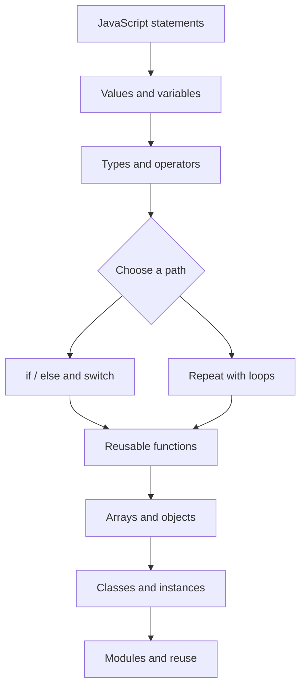
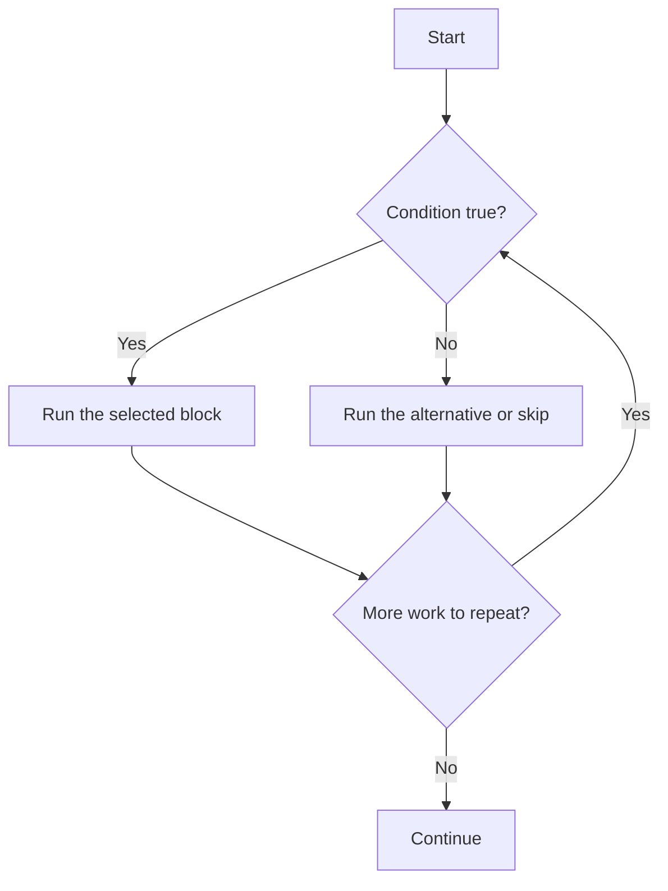
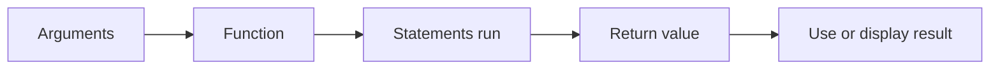

<div align="center">

# Week 04: JavaScript Foundations

**From values and decisions to reusable functions, collections, and objects.**

[](https://x.com/Aman_Pal_1)
[](https://www.linkedin.com/in/udityapal)
[-Email-D14836?style=flat&logo=gmail&logoColor=white>)](mailto:udityapal2024@gmail.com)

</div>

## The story of this week

A web page can display content, but JavaScript gives that page the ability to think and respond. Week 04 starts with small instructions and values, then builds toward decisions, repetition, reusable functions, and objects. Each concept adds another tool for turning a problem into a sequence of understandable steps.

The lesson files are hands-on practice: they print examples to the console, define functions, work with arrays, and introduce classes and module exports. The aim is to understand how these building blocks fit together before using them in larger browser applications.

## Learning goals

- Declare values with `let` and `const` and recognize common JavaScript data types.
- Use operators, conditionals, and `switch` statements to make decisions.
- Repeat work with `for`, `while`, and `do...while` loops.
- Write functions that accept inputs, perform work, and return results.
- Store and transform collections with arrays and common array methods.
- Model related data with objects and create instances with classes.
- Recognize how a module can expose selected functions for reuse.

## Learning roadmap



## What is in this folder

| File                           | Purpose                                                                                                                           |
| ------------------------------ | --------------------------------------------------------------------------------------------------------------------------------- |
| [`index.html`](./index.html)   | A minimal Week 04 page linked to the stylesheet and `script.js`.                                                                  |
| [`style.css`](./style.css)     | Basic page styling, including a centered layout and dark background.                                                              |
| [`script.js`](./script.js)     | A small browser alert demonstrating that JavaScript can run when the page loads.                                                  |
| [`weekFour.js`](./weekFour.js) | Main console-based lesson: variables, types, arrays, loops, conditions, functions, classes, inheritance, and an export statement. |
| [`pose6.jpeg`](./pose6.jpeg)   | Photo included with the Week 04 learning materials.                                                                               |

## Main lesson topics

### 1. Values and data types

The lesson introduces strings, numbers, booleans, `null`, `undefined`, objects, and arrays. It also uses `typeof` to inspect values and demonstrates how `let` and `const` are used when declaring variables.

```js
const student = { name: 'Aman', active: true }
const topics = ['variables', 'functions', 'objects']

console.log(student.name)
console.log(topics.length)
```

### 2. Decisions and repetition

Conditional statements select a path based on a condition. Loops repeat a block of code while their stopping condition allows it. The lesson includes `if` / `else if` / `else`, `switch`, and three loop forms.



### 3. Functions

Functions package a task so it can be called with different inputs. The examples include a named function, parameters, a return value, and an arrow function.



### 4. Arrays and objects

Arrays group ordered values. The lesson practices adding and removing items with `push`, `pop`, `shift`, and `unshift`, then iterates and transforms values with `forEach` and `map`. Objects group related data under named properties.

### 5. Classes, inheritance, and modules

The `Person` class demonstrates a constructor and instance properties. `Student` extends `Person` and calls `super()` to initialize the inherited fields before adding a student ID. The file ends by exporting selected functions, introducing a way to share code between modules.

### 🖼️ Media & Visuals

<div align="center">
  
  <p><em>A moment from the Week 04 lesson.</em></p>
</div>

## Run and explore

1. Open `index.html` directly in a browser or launch it with VS Code Live Server.
2. The page loads `script.js`, which displays a browser alert.
3. Open the browser developer tools and select the Console tab to inspect JavaScript output.
4. Read through `weekFour.js` and try changing sample values or function arguments.

`weekFour.js` is currently a separate lesson file and is not loaded by `index.html`. It contains an ES module export, so to execute it in the browser, load it from an HTML `<script type="module">` element or import it from another module. The examples also include top-level `console.log` calls, which run when the module is loaded.

## Suggested practice

- Write a function that accepts two numbers and returns their product.
- Add a new item to an array, then create a second array of transformed values with `map`.
- Use a conditional to classify a score into a grade range.
- Create a `Course` class and extend it with a `LiveCourse` class.
- Move one reusable function into its own module and export it.

## Key takeaway

JavaScript becomes easier to reason about when a program is built from small pieces: values hold information, conditions choose what happens, loops handle repetition, functions organize actions, and objects represent related data. Week 04 lays that foundation for the interactive browser work ahead.

For repository contribution guidance, see [`CONTRIBUTING.md`](../CONTRIBUTING.md). For licensing details, see [`LICENSE`](../LICENSE).
