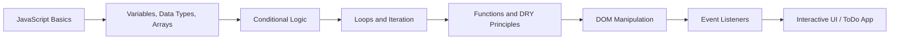
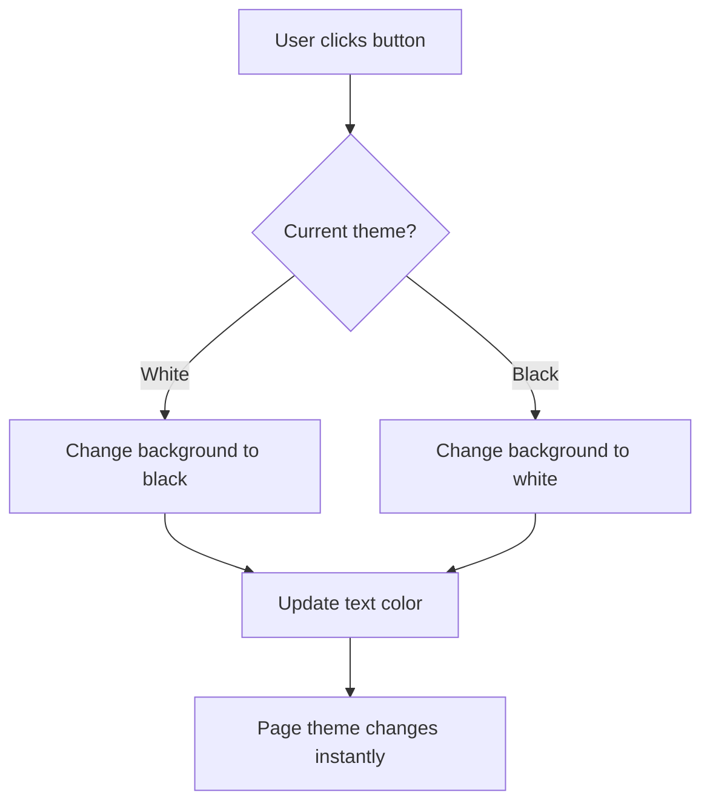

# Week 08 - JavaScript + DOM Fundamentals

This folder marks the moment when JavaScript stops being just a language in the console and starts controlling the browser itself. It is the bridge between raw programming logic and real user-facing web interfaces.

This week is split into two major parts:

- [Week-08-A](Week-08-A) — DOM, browser objects, event handling, and a practical ToDo App
- [Week-08-B](Week-08-B) — JavaScript fundamentals like variables, arrays, conditionals, and loops

---

## 📸 Group Pose

This is the energy of the cohort during this learning stage — a visual reminder that the journey is not just about code, but about consistency, curiosity, and growth.


---

## 🌱 Why this week matters

Week 08 is a major milestone in the cohort because it introduces the connection between:

- JavaScript logic
- HTML structure
- CSS styling
- browser behavior

This is where code becomes interactive. Buttons react, elements change, user input triggers behavior, and pages become dynamic instead of static.

---

## 🧭 Folder-by-folder explanation

### 1) [Week-08-A](Week-08-A)

This subfolder is focused on the Document Object Model (DOM) and browser programming.

#### What it teaches

- `window` and `document` objects
- how to use `alert()`, `console.log()`, and `document.write()`
- selecting DOM elements
- adding click events with `addEventListener`
- changing colors, text, and styles dynamically
- creating and removing elements from the page
- building a mini application using pure JavaScript

#### Main files in this folder

- `index.js` — basics of browser access and document manipulation
- `Todo.js` — reusable theme toggle logic with DRY principle
- `themebuttoninToDo.html` — a theme toggle prototype integrated into a page
- `ToDo App/script.js` — dynamic task creation and deletion
- `style.css` — layout and visual styling for the demo page
- `weekEight.js` — additional JavaScript practice and dashboard-style examples

#### Learning outcome

This folder teaches the idea that JavaScript can control the user interface in real time. The page is no longer just a static HTML file; it becomes an interactive application.

---

### 2) [Week-08-B](Week-08-B)

This subfolder focuses on the language fundamentals that power everything else.

#### What it teaches

- variable declarations (`var`, `let`, `const`)
- primitive data types
- arrays and objects
- conditional statements
- loops and iteration techniques
- higher-order functions and array methods like `filter()` and `reduce()`

#### Main files in this folder

- `EightB_variable_datatypes.js` — data types, conversions, operators, Math methods
- `02_array_object.js` — arrays, objects, nested data, destructuring
- `03_if_else.js` — conditional logic and decision-making
- `04_iteration.js` — loops and reduction/filtering patterns
- `index.html` — page wrapper for the learning segment

#### Learning outcome

This folder builds the mental model for solving logic problems in JavaScript. Without this foundation, no DOM project would make sense.

---

## 🗂️ Repository structure

```bash
Week-08/
├── README.md
├── Week-08-A/
│   ├── index.html
│   ├── index.js
│   ├── style.css
│   ├── Todo.js
│   ├── weekEight.js
│   ├── themebuttoninToDo.html
│   ├── pose5.jpeg
│   ├── README.md
│   ├── chai-cohort.ico
│   └── ToDo App/
│       ├── index.html
│       └── script.js
│
├── Week-08-B/
│   ├── index.html
│   ├── README.md
│   ├── EightB_variable_datatypes.js
│   ├── 02_array_object.js
│   ├── 03_if_else.js
│   └── 04_iteration.js
└──
```

---

## 🧠 Concept flow of the week



This diagram shows the natural learning progression:

1. Learn JS basics
2. Understand logic and data flow
3. Learn DOM and browser APIs
4. Build interactive UI applications

---

## 🔄 Theme toggle and ToDo app flow



This is the heart of the DOM work in Week-08-A. It demonstrates how JavaScript reacts to user actions and updates the UI without reloading the page.

---

## ✅ Key takeaways from this week

- JavaScript is not only about calculation; it can manipulate the user interface.
- The DOM is the browser’s representation of the page.
- Events connect user actions to code execution.
- Reusable functions make code cleaner and easier to maintain.
- Arrays and objects are the foundation of structured web data.
- Conditionals and loops control program flow and behavior.

---

## 🛠️ Skills built by the end of Week 08

By the end of this week, learners are typically able to:

- understand how JS interacts with HTML and CSS
- change content and styling dynamically
- handle user clicks and events
- build simple interactive UI elements
- create task-based mini apps
- think in logical conditions and loops

---

## 🚀 How to explore this folder

### For DOM examples

Open any HTML file in the browser with Live Server or browser preview.

### For JS practice files

Use Node.js in the terminal:

```bash
node "Week-08-B/EightB_variable_datatypes.js"
node "Week-08-B/02_array_object.js"
node "Week-08-B/03_if_else.js"
node "Week-08-B/04_iteration.js"
```

---

## 🧩 Final summary

Week 08 is one of the most transformational weeks in the cohort. It is the point where the learner stops writing code just for the console and starts building things that users can actually see and click.

This folder combines:

- logic and fundamentals from [Week-08-B](Week-08-B)
- interactivity and real UI building from [Week-08-A](Week-08-A)

Together, they prepare the learner for the next stage of frontend development, where state, components, and user interfaces become more complex and more powerful.

---

## 🔜 Next step

After Week 08, the natural next focus is:

- DOM challenges
- more project-oriented JS apps
- forms and validation
- arrays/objects real-world usage
- moving toward React and UI component thinking
