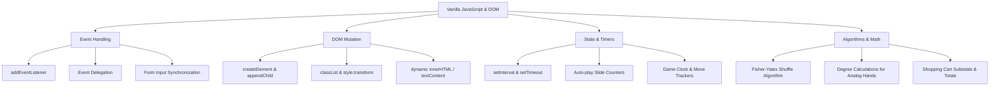

<div align="center">

  

  # 🚀 Week 13: The DOM Mastery Chronicles ⚡
  ### *From Static Markup to Dynamic Magic — A Developer's Epic Journey*

  <p align="center">
    A comprehensive suite of 10 interactive JavaScript DOM challenges created during the <b>Chai Aur Code Cohort</b>.
  </p>

  <p align="center">
    <a href="https://x.com/Aman_Pal_1"></a>
    <a href="https://www.linkedin.com/in/udityapal"></a>
    <a href="mailto:udityapal2024@gmail.com"></a>
  </p>

  <p align="center">
    
    
    
    
    
  </p>

</div>

---

## 📖 The Storyline: *The Awakening of the DOM Mage*

> *Once upon a time in the realm of Web Development, code lived in silence. HTML elements stood frozen in rigid structures, while CSS dressed them in static cloaks. But deep within **Week 13 of the Chai Aur Code Cohort**, a spark ignited.*
>
> *Equipped with Vanilla JavaScript and the ancient spellbook of the **Document Object Model (DOM)**, our developer embarked on a legendary quest across **10 Sacred Trials**. Each trial posed a unique challenge — turning light into darkness, listening to user whispers in real-time, sculpting dynamic elements out of pure logic, and bending time itself into analog and digital clocks.*
>
> *Step into the laboratory below and witness how raw code transforms into living, breathing web experiences!* 🪄✨

---

## 📌 Table of Contents

- [📖 The Storyline](#-the-storyline-the-awakening-of-the-dom-mage)
- [🎯 Journey Overview & Challenge Matrix](#-journey-overview--challenge-matrix)
- [🧩 Detailed Breakdown of the 10 Trials](#-detailed-breakdown-of-the-10-trials)
  - [Trial 1: Light Bulb Toggle 💡](#trial-1-light-bulb-toggle-)
  - [Trial 2: Chameleon Text Color Transformer 🦎](#trial-2-chameleon-text-color-transformer-)
  - [Trial 3: Real-Time Live Profile Preview 📋](#trial-3-real-time-live-profile-preview-)
  - [Trial 4: Dynamic Task Manager 🧏🏻‍♂️](#trial-4-dynamic-task-manager-)
  - [Trial 5: Interactive Image Carousel 🖼️](#trial-5-interactive-image-carousel-)
  - [Trial 6: Chronos Dual Clock System ⏰](#trial-6-chronos-dual-clock-system-)
  - [Trial 7: Interactive Accordion 🪗](#trial-7-interactive-accordion-)
  - [Trial 8: E-Commerce Shopping Cart 🛒](#trial-8-e-commerce-shopping-cart-)
  - [Trial 9: Off-Canvas Sliding Navigation Menu 🪟](#trial-9-off-canvas-sliding-navigation-menu-)
  - [Trial 10: Mind Palace Memory Card Game 🂫](#trial-10-mind-palace-memory-card-game-)
- [🛠️ Core Concepts Unlocked](#%EF%B8%8F-core-concepts-unlocked)
- [📁 Project Folder Structure](#-project-folder-structure)
- [⚡ Quick Start & Setup](#-quick-start--setup)
- [🌟 Epilogue & Acknowledgments](#-epilogue--acknowledgments)

---

## 🎯 Journey Overview & Challenge Matrix

| # | Trial Name | Core Concept Unlocked | Primary DOM APIs & JS Features | Key Interactivity |
|---|---|---|---|---|
| **01** | [Light Bulb Toggle](#trial-1-light-bulb-toggle-) | State Toggle & Dark Mode | `classList.toggle()`, `addEventListener` | Glowing effect & theme switching |
| **02** | [Text Color Transformer](#trial-2-chameleon-text-color-transformer-) | Inline Style Mutation | `element.style.color`, Event Delegation | Dynamic palette switching |
| **03** | [Live Profile Preview](#trial-3-real-time-live-profile-preview-) | Real-time Two-way Binding | `input` events, `innerText`, Conditional Fallbacks | Instant preview synchronization |
| **04** | [Dynamic Task Manager](#trial-4-dynamic-task-manager-) | DOM Tree CRUD & Stats | `createElement()`, `appendChild()`, `removeChild()` | Task counter, strikethrough, empty states |
| **05** | [Image Carousel](#trial-5-interactive-image-carousel-) | Timers & Navigation State | `setInterval()`, `clearInterval()`, Dynamic Dots | Auto-play slideshow & remaining timer |
| **06** | [Chronos Dual Clock](#trial-6-chronos-dual-clock-system-) | Mathematical CSS Rotation | `Date()`, `transform: rotate()`, Trigonometry | Analog clock hands + Digital HH:MM:SS |
| **07** | [Interactive Accordion](#trial-7-interactive-accordion-) | Single-active Collapsible State | CSS transition heights, Dynamic section adding | Animated drawer collapse & expand |
| **08** | [Shopping Cart](#trial-8-e-commerce-shopping-cart-) | Complex State & Math Calculations | Array manipulation, Dynamic element formatting | Subtotals, total calculation, item removal |
| **09** | [Sliding Navigation Menu](#trial-9-off-canvas-sliding-navigation-menu-) | Off-Canvas Layouts & Backdrop | Blur overlay, transform transitions, outside click | Smooth drawer menu dismissal |
| **10** | [Memory Card Game](#trial-10-mind-palace-memory-card-game-) | Game Loops & State Matching | Array Shuffle (Fisher-Yates), Card Flipping, Timers | Moves counter, win dialog, state reset |

---

## 🧩 Detailed Breakdown of the 10 Trials

### Trial 1: Light Bulb Toggle 💡
> *In the dark cavern, the hero needed light to read the ancient scrolls...*

* **Objective**: Create a seamless bulb toggle with responsive light/dark theme modes.
* **Key Features**:
  * Glowing gold bulb light when active vs. sleek grayscale when deactivated.
  * Synchronized full-page background dark theme toggling.
  * Dynamic button label text updating ("Turn On" / "Turn Off").
* **Code Highlight**:
  ```javascript
  function funBulb() {
      if (!isBulbOn) {
          bulb.style.backgroundColor = 'var(--secondryColor)';
          bulb.style.boxShadow = '0 0 20px var(--secondryColor)';
          onOffBtn.innerText = 'Turn Off';
          isBulbOn = true;
      } else {
          bulb.style.backgroundColor = 'var(--whiteColor)';
          bulb.style.boxShadow = 'none';
          onOffBtn.innerText = 'Turn On';
          isBulbOn = false;
      }
  }
  ```

---

### Trial 2: Chameleon Text Color Transformer 🦎
> *Mastering color manipulation allows a developer to paint emotions on screen...*

* **Objective**: Build an interactive palette control to alter heading text styles dynamically.
* **Key Features**:
  * 4 vibrant preset colors (Red, Green, Blue, Purple) and an instant Reset button.
  * Direct style mutations without layout reflows.
* **Code Highlight**:
  ```javascript
  redBtn.addEventListener('click', () => {
      h1Display.style.color = 'red';
  });
  resetBtn.addEventListener('click', () => {
      h1Display.style.color = 'black';
  });
  ```

---

### Trial 3: Real-Time Live Profile Preview 📋
> *As the hero filled out their credentials, the scroll instantly illuminated their identity...*

* **Objective**: Build a real-time reactive user profile card updating as the user types into form fields.
* **Key Features**:
  * Instant reactive updates across Name, Job Title, Age, and Bio fields.
  * Automatic fallback handling displaying `"Not provided"` whenever a field is cleared.
* **Code Highlight**:
  ```javascript
  nameInput.addEventListener('input', (e) => {
      previewName.innerText = e.target.value.trim() !== '' ? e.target.value : 'Not provided';
  });
  ```

---

### Trial 4: Dynamic Task Manager 🧏🏻‍♂️
> *Every quest requires tracking tasks, defeating sub-quests, and monitoring progress...*

* **Objective**: Implement a full-featured To-Do list with live statistical updates and empty-list states.
* **Key Features**:
  * Add tasks via button click or `Enter` keypress.
  * Interactive checkboxes to toggle task completion with strikethrough styling.
  * Live total tasks count and completed tasks counter.
  * Conditional empty state banner ("No tasks yet. Add one above!").
* **Code Highlight**:
  ```javascript
  const taskItem = document.createElement('div');
  taskItem.innerHTML = `
      <input type="checkbox" class="task-checkbox">
      <span class="task-text">${taskText}</span>
      <button class="delete-btn">Delete</button>
  `;
  ```

---

### Trial 5: Interactive Image Carousel 🖼️
> *Viewing visions of distant lands required a slideshow powered by precise time mechanics...*

* **Objective**: Construct an image slider featuring manual navigation controls, indicator dots, and an auto-play countdown mode.
* **Key Features**:
  * Next & Previous buttons with wrap-around slide index loop.
  * Interactive indicator dots reflecting the active slide.
  * Auto-play mode with live second-by-second transition countdown timer.
* **Code Highlight**:
  ```javascript
  function startAutoPlay() {
      autoPlayInterval = setInterval(() => {
          currentIndex = (currentIndex + 1) % images.length;
          updateCarousel();
      }, 3000);
  }
  ```

---

### Trial 6: Chronos Dual Clock System ⏰
> *To control the web, one must first master time itself...*

* **Objective**: Design a synchronized digital clock alongside an analog clock with smooth ticking hands.
* **Key Features**:
  * **Digital Clock**: 24/12-hour formatted `HH:MM:SS` display padded with leading zeros.
  * **Analog Clock**: Circular clock face with hour, minute, and second hands rotating mathematically based on current time angle `(degrees = time * multiplier)`.
  * Live current date format `DD-MM-YYYY` display.
* **Code Highlight**:
  ```javascript
  const secDeg = seconds * 6;
  const minDeg = (minutes + (seconds / 60)) * 6;
  const hourDeg = ((date.getHours() % 12) + (minutes / 60)) * 30;

  secHand.style.transform = `rotate(${secDeg}deg)`;
  minHand.style.transform = `rotate(${minDeg}deg)`;
  hourHand.style.transform = `rotate(${hourDeg}deg)`;
  ```

---

### Trial 7: Interactive Accordion 🪗
> *Secrets are best revealed one chapter at a time...*

* **Objective**: Build a clean collapsible accordion UI adhering to strict single-section active rules.
* **Key Features**:
  * Smooth expand/collapse animation with rotating indicator arrows (▼ to ▲).
  * Enforced single open section rule: opening a new accordion item automatically closes any open item.
  * Dynamic section creator button allowing runtime addition of new accordion blocks.
* **Code Highlight**:
  ```javascript
  accordionHeaders.forEach(header => {
      header.addEventListener('click', () => {
          const accordionItem = header.parentElement;
          const isOpen = accordionItem.classList.contains('active');
          document.querySelectorAll('.accordion-item').forEach(item => item.classList.remove('active'));
          if (!isOpen) accordionItem.classList.add('active');
      });
  });
  ```

---

### Trial 8: E-Commerce Shopping Cart 🛒
> *Trading gear before entering battle requires real-time calculations...*

* **Objective**: Create an interactive shopping cart system with product cards, item quantity adjustments, and auto-calculating totals.
* **Key Features**:
  * Product gallery with images, titles, prices, and "Add to Cart" triggers.
  * Quantity increment/decrement buttons with real-time subtotal recalculations (`price × quantity`).
  * Instant total cart value accumulation.
* **Code Highlight**:
  ```javascript
  function calculateTotal() {
      const total = cart.reduce((acc, item) => acc + (item.price * item.quantity), 0);
      totalAmountDisplay.innerText = `Total: $${total.toFixed(2)}`;
  }
  ```

---

### Trial 9: Off-Canvas Sliding Navigation Menu 🪟
> *A hidden portal that slides into view whenever called by the traveler...*

* **Objective**: Engineer a responsive off-canvas drawer navigation menu with smooth transitions.
* **Key Features**:
  * Hamburger menu button trigger that slides in a right-side navigation drawer.
  * Backdrop overlay dimming the main content.
  * Multiple dismissal options: Close button `×`, menu item selection, or clicking anywhere on the overlay.
* **Code Highlight**:
  ```javascript
  openBtn.addEventListener('click', () => {
      slidingMenu.classList.add('active');
      overlay.classList.add('active');
  });
  overlay.addEventListener('click', closeMenu);
  ```

---

### Trial 10: Mind Palace Memory Card Game 🂫
> *The final boss trial: testing memory, speed, and precision in an epic card matching arena!*

* **Objective**: Build a complete 4×4 memory card matching game complete with shuffling, timers, move counts, and victory dialogs.
* **Key Features**:
  * Fisher-Yates shuffle algorithm generating randomized 8 pair emoji layouts (🐶, 🐱, 🐭, 🐹, 🐰, 🦊, 🐻, 🐼).
  * 3D card flip animation upon click.
  * Win condition detection displaying custom victory alerts with final time and move score.
  * Game restart button resetting timers, card grids, and match counters.
* **Code Highlight**:
  ```javascript
  cardsArray = [...cards, ...cards].sort(() => Math.random() - 0.5);
  if (isMatch) {
      matches++;
      if (matches === 8) {
          clearInterval(timerInterval);
          alert(`You won in ${moves} moves and ${time} seconds!`);
      }
  }
  ```

---

## 🛠️ Core Concepts Unlocked



---

## 📁 Project Folder Structure

```text
Week-13/
│
├── Assets/
│   ├── chai-cohort.ico         # Official Cohort Icon
│   └── pose.jpeg               # Main Project Banner Image
│
├── DOM CHALLENGES/
│   ├── Challenge 1/            # 💡 Light Bulb Toggle & Theme
│   │   ├── index.html
│   │   ├── script.js
│   │   └── style.css
│   ├── Challenge 2/            # 🦎 Change Text Color
│   │   ├── index.html
│   │   ├── script.js
│   │   └── style.css
│   ├── Challenge 3/            # 📋 Real-time Form Input Display
│   │   ├── index.html
│   │   ├── script.js
│   │   └── style.css
│   ├── Challenge 4/            # 🧏🏻‍♂️ Task Management To-Do
│   │   ├── index.html
│   │   ├── script.js
│   │   └── style.css
│   ├── Challenge 5/            # 🖼️ Image Carousel App
│   │   ├── index.html
│   │   ├── script.js
│   │   └── style.css
│   ├── Challenge 6/            # ⏰ Dual Analog & Digital Clock
│   │   ├── index.html
│   │   ├── script.js
│   │   └── style.css
│   ├── Challenge 7/            # 🪗 Interactive Accordion
│   │   ├── index.html
│   │   ├── script.js
│   │   └── style.css
│   ├── Challenge 8/            # 🛒 Simple Shopping Cart
│   │   ├── index.html
│   │   ├── script.js
│   │   ├── style.css
│   │   └── d1.jpg ... d4.jpg
│   ├── Challenge 9/            # 🪟 Off-Canvas Sliding Menu
│   │   ├── index.html
│   │   ├── script.js
│   │   └── style.css
│   └── Challenge 10/           # 🂫 Interactive Memory Card Game
│       ├── index.html
│       ├── script.js
│       └── style.css
│
├── index.html                  # Main Portfolio Portal
├── thirteen.js                 # Helper Utilities
└── README.md                   # Complete Documentation
```

---

## ⚡ Quick Start & Setup

Want to test the challenges locally on your machine? Follow these simple steps:

1. **Clone the Repository**:
   ```bash
   git clone https://github.com/Uditya-Pal-1/Chai-Aur-Code-Cohort.git
   ```

2. **Navigate to Week 13 Directory**:
   ```bash
   cd Chai-Aur-Code-Cohort/Week-13
   ```

3. **Launch in Browser**:
   * Open `index.html` directly in your browser or use VS Code's **Live Server** extension.
   * Explore individual challenge folders (`DOM CHALLENGES/Challenge 1` through `Challenge 10`) to inspect the isolated HTML, CSS, and JS implementations.

---

## 🌟 Epilogue & Acknowledgments

> *And so, the developer emerged from Week 13 not merely as a reader of code, but as a master weaver of web interactions. From light switches to memory grids, the DOM was no longer a mystery, but a canvas of endless possibilities.*

### 💖 Special Thanks & Shoutouts
* **[Hitesh Choudhary Sir](https://github.com/hiteshchoudhary)** for creating the incredible **Chai Aur Code Cohort** and inspiring thousands of developers to build through hands-on practice.
* **The Chai Aur Code Community** for constant peer reviews, encouragement, and collaborative spirit.

---

<div align="center">
  <sub>Built with ☕, passion, and pure Vanilla JavaScript by <b>Uditya Pal</b></sub>
  <br/>
  <a href="#-week-13-the-dom-mastery-chronicles-"><b>[ Back to Top ⬆️ ]</b></a>
</div>