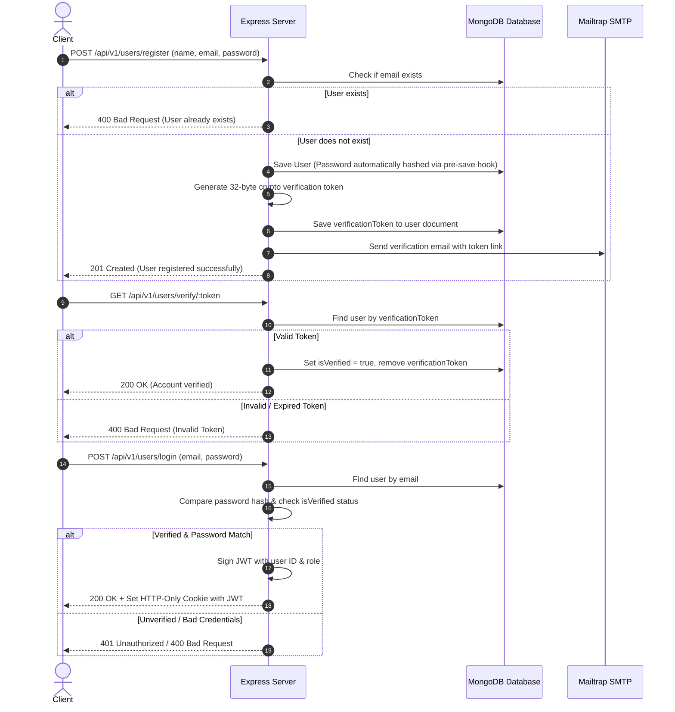

# 🚀 Week 15: FullStack Authentication & Backend Service

Welcome to **Week 15** of the **Chai-Aur-Code-Cohort**! This repository module showcases the implementation of a production-ready Node.js & Express RESTful backend architecture featuring user authentication, email verification using Mailtrap & Nodemailer, JWT session security, password encryption, and MongoDB object modeling via Mongoose.

---

## 📌 Table of Contents

- [Overview](#-overview)
- [Folder Structure](#-folder-structure)
- [Tech Stack & Dependencies](#-tech-stack--dependencies)
- [Key Features](#-key-features)
- [API Architecture & Endpoints](#-api-architecture--endpoints)
- [Authentication & Verification Flow](#-authentication--verification-flow)
- [Environment Configuration](#-environment-configuration)
- [Getting Started](#-getting-started)
- [Media & Visuals](#-media--visuals)
- [Author & Acknowledgments](#-author--acknowledgments)

---

## 🌟 Overview

The primary goal of Week 15 is to build a robust, modular, and secure user management backend module following standard MVC (Model-View-Controller) architecture patterns.

It handles complete user lifecycles:
1. **User Registration**: Data validation and duplicate account detection.
2. **Password Security**: Asynchronous `bcryptjs` password hashing executed in Mongoose pre-save middleware.
3. **Email Verification**: Dispatches unique 32-byte cryptographic tokens (`crypto`) via `nodemailer` using Mailtrap SMTP sandbox.
4. **Account Activation**: Validates verification tokens to update account status (`isVerified: true`).
5. **Secure Session Login**: Authentication with JWT issuance (`jsonwebtoken`), verification status checks, and automated cookie transmission via `cookie-parser`.

---

## 📁 Folder Structure

```text
Week-15/
├── FullStack Project/          # Main Express backend project
│   ├── controller/
│   │   └── user.controller.js  # Controller logic for auth, verification & login
│   ├── model/
│   │   └── User.model.js       # Mongoose User Schema & password hashing hooks
│   ├── routes/
│   │   └── user.routes.js      # Express router mapping API endpoints
│   ├── utils/
│   │   └── db.js               # MongoDB Mongoose database connection helper
│   ├── .env                    # Environment secrets (git-ignored)
│   ├── .env.sample             # Environment configuration template
│   ├── .gitignore              # Git ignore rules
│   ├── index.js                # Express app initialization & server entrypoint
│   ├── package.json            # Project metadata & dependencies
│   └── package-lock.json       # Locked dependency versions
├── assets/                     # Visual assets and media
│   └── pose time Node Ninja.jpeg
└── Readme.md                   # Main module documentation
```

---

## 🛠 Tech Stack & Dependencies

| Category | Technology | Description |
| :--- | :--- | :--- |
| **Runtime & Framework** | [Node.js](https://nodejs.org/), [Express v5](https://expressjs.com/) | High-performance HTTP server & REST routing |
| **Database** | [MongoDB](https://www.mongodb.com/), [Mongoose v9](https://mongoosejs.com/) | NoSQL database & ODM object data modeling |
| **Authentication** | [JSON Web Tokens (JWT)](https://jwt.io/) | Stateless authorization tokens |
| **Security** | [BcryptJS](https://www.npmjs.com/package/bcryptjs), [Crypto](https://nodejs.org/api/crypto.html) | Password hashing & cryptographically secure token generation |
| **Email Services** | [Nodemailer](https://nodemailer.com/), Mailtrap | Transactional email delivery & SMTP sandbox testing |
| **Middleware & Tools** | `cors`, `cookie-parser`, `dotenv`, `nodemon` | CORS policy management, cookie parsing, environment variables, live server reload |

---

## ✨ Key Features

- 🔐 **Pre-Save Password Hashing**: Passwords are automatically salted and hashed (`salt factor = 10`) before saving to the database using Mongoose middleware hooks.
- 📧 **Token-Based Email Verification**: Generates secure hex tokens sent via Nodemailer to verify user identity before granting login access.
- 🛡️ **JWT & HTTP-Only Cookie Authentication**: Authenticated sessions deliver JWTs stored in secure, `httpOnly` cookies to protect against XSS attacks.
- 👥 **Role-Based Schema**: Extended User schema supporting roles (`user` vs `admin`) and password reset placeholders (`resetPasswordToken`, `resetPasswordExpires`).
- 🌐 **Configurable CORS & Body Parsing**: Configured for cross-origin credentials sharing and URL-encoded / JSON body handling.

---

## 📡 API Architecture & Endpoints

Base URL Prefix: `/api/v1/users`

| Endpoint | Method | Access | Description | Request Payload / Parameters |
| :--- | :---: | :---: | :--- | :--- |
| `/api/v1/users/register` | `POST` | Public | Registers a new user & triggers verification email | `{ name, email, password }` |
| `/api/v1/users/verify/:token` | `GET` | Public | Validates verification token & activates user account | URL Param: `token` |
| `/api/v1/users/login` | `POST` | Public | Authenticates verified user & issues JWT cookie | `{ email, password }` |
| `/` | `GET` | Public | Health check / test route | None |

---

## 🔄 Authentication & Verification Flow



---

## ⚙️ Environment Configuration

To run the backend, create a `.env` file inside the `FullStack Project` directory based on `.env.sample`:

```env
# Server Setup
PORT=4000
BASE_URL=http://localhost:4000
JWT_SECRET=your_jwt_secret_key_here

# Database
MONGO_URL=mongodb://localhost:27017/chai-aur-cohort

# Mailtrap / Nodemailer SMTP Credentials
MAILTRAP_HOST=sandbox.smtp.mailtrap.io
MAILTRAP_PORT=2525
MAILTRAP_USERNAME=your_mailtrap_username
MAILTRAP_PASSWORD=your_mailtrap_password
MAILTRAP_SENDEREMAIL=no-reply@demomailtrap.com
```

---

## 🚀 Getting Started

### Prerequisites
- [Node.js](https://nodejs.org/) (v18+ recommended)
- [MongoDB](https://www.mongodb.com/) running locally or a MongoDB Atlas URI

### Installation & Execution

1. **Navigate to the Project Directory**:
   ```bash
   cd "FullStack Project"
   ```

2. **Install Dependencies**:
   ```bash
   npm install
   ```

3. **Configure Environment Variables**:
   Copy `.env.sample` to `.env` and fill in your database & SMTP credentials:
   ```bash
   cp .env.sample .env
   ```

4. **Launch Development Server**:
   ```bash
   npm run dev
   ```
   The server will start on port `4000` (or specified `PORT`) and connect to MongoDB.

---

## 🖼️ Media & Visuals


---

## 👤 Author & Acknowledgments

- **Author**: Uditya Pal
- **Course**: Chai-Aur-Code-Cohort (Week 15)
- **Instructor / Community**: Hitesh Choudhary / Chai aur Code Community
