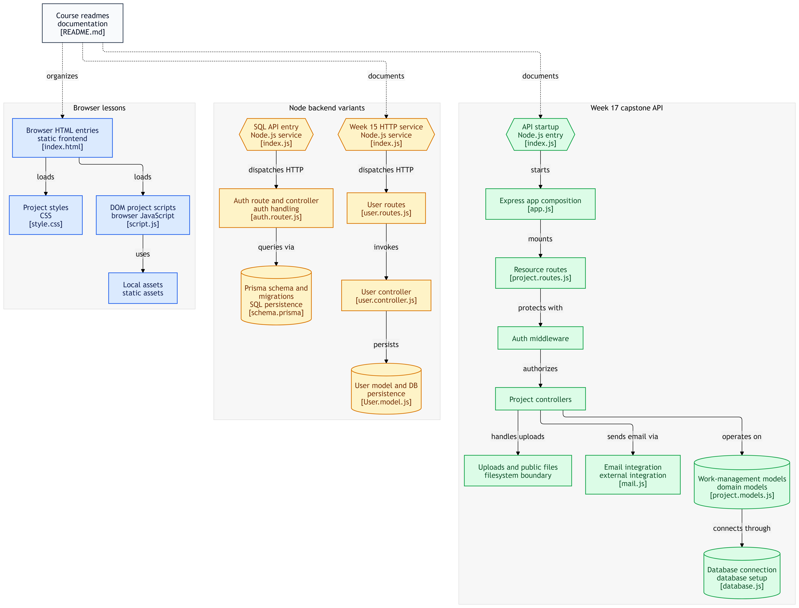

# 🚀 Week 17: Production Backend Architecture & Project Management REST API

[](https://nodejs.org/)
[](https://expressjs.com/)
[](https://www.mongodb.com/)
[](https://jwt.io/)
[](https://prettier.io/)
[](https://chaicode.com/)
[](#license)

Welcome to **Week 17** of the **Chai Aur Code Web Development Cohort**. This week focuses on designing and implementing a production-grade, enterprise-ready **Backend Project Management & Collaboration RESTful API** using **Node.js, Express.js (v5), and MongoDB with Mongoose ORM**.

---

## 📋 Table of Contents

- [🌟 Overview \& Learning Objectives](#-overview--learning-objectives)
- [🖼️ Architecture \& Entity-Relationship Diagram](#️-architecture--entity-relationship-diagram)
- [🛠️ Tech Stack \& Dependencies](#️-tech-stack--dependencies)
- [📂 Repository Structure](#-repository-structure)
- [✨ Key Features](#-key-features)
- [📡 API Endpoints Reference](#-api-endpoints-reference)
- [🔐 Environment Variables Configuration](#-environment-variables-configuration)
- [🚀 Quick Start \& Installation](#-quick-start--installation)
- [🧠 Architectural Patterns \& Code Standards](#-architectural-patterns--code-standards)
- [👨‍💻 Author \& Acknowledgments](#-author--acknowledgments)

---

## 🌟 Overview & Learning Objectives

During Week 17, the primary objective was moving from basic Node/Express server setups to structuring a **scalable, modular, production-standard backend core**. 

### 💡 Core Takeaways & Learnings:
- **Clean Architecture & Separation of Concerns**: Isolating controllers, routes, schemas, middlewares, custom utilities, services, and validators.
- **Robust Error Handling**: Standardizing error handling using `ApiError` class and global `errorHandler` middleware.
- **Unified API Response Schema**: Enforcing a consistent payload structure via `ApiResponse` wrapper across all endpoints.
- **Advanced Authentication & Authorization**:
  - Access Token and Refresh Token flow stored in HTTP-Only Cookies / Bearer Headers.
  - Granular Role-Based Access Control (RBAC): `ADMIN`, `PROJECT_ADMIN`, and `MEMBER`.
- **Relational Data Modeling in MongoDB**:
  - Managing normalized schema relationships between `Users`, `Projects`, `ProjectMembers`, `Tasks`, `SubTasks`, and `Notes`.
- **Transactional Email Service**: Integrated `Nodemailer` + `Mailtrap` + `Mailgen` to send formatted HTML emails for email verification and password reset flows.
- **Validation Pipeline**: Building middleware-based request body validation using `express-validator`.
- **Multipart File Uploads**: Integrating `multer` middleware for single/multiple file handling.

---

## 🖼️ Architecture & Entity-Relationship Diagram

The visual representation below illustrates the database relations, system workflows, and operational flow across models (Users, Projects, Members, Tasks, Subtasks, Notes).

<div align="center">
  
</div>

---

## 🛠️ Tech Stack & Dependencies

### Core Frameworks & Runtime
- **Node.js** (v18+ recommended) — JavaScript runtime environment
- **Express.js** (`^5.2.1`) — Fast, unopinionated web framework for Node.js
- **MongoDB & Mongoose** (`^9.9.3`) — NoSQL database & Object Data Modeling (ODM)

### Authentication & Security
- **JSONWebToken (`jsonwebtoken`)** — JWT token generation & verification
- **Bcrypt (`bcrypt`)** — Secure password hashing
- **Cookie Parser (`cookie-parser`)** — Middleware for parsing HTTP request cookies
- **CORS (`cors`)** — Cross-Origin Resource Sharing configuration

### Utilities & Services
- **Express Validator (`express-validator`)** — Request payload validation and sanitization
- **Multer (`multer`)** — File uploads middleware
- **Nodemailer (`nodemailer`) & Mailtrap (`mailtrap`)** — SMTP email transmission
- **Mailgen (`mailgen`)** — Programmatic HTML email design generation
- **Dotenv (`dotenv`)** — Environment variable management

### Developer Tools
- **Nodemon (`nodemon`)** — Development server hot-reloading
- **Prettier (`prettier`)** — Opinionated code formatter

---

## 📂 Repository Structure

```text
Week-17/
├── assets/
│   ├── .gitkeep
│   └── diagram.png                # System & Architecture ER Diagram
├── Backend Project/
│   ├── public/                    # Static uploaded files / assets
│   ├── src/
│   │   ├── constants/
│   │   │   └── constants.js       # Global Enums (UserRolesEnum, TaskStatusEnum)
│   │   ├── controllers/           # Request handlers / Controller business logic
│   │   │   ├── auth.controllers.js
│   │   │   ├── healthcheck.controllers.js
│   │   │   ├── note.controllers.js
│   │   │   ├── project.controllers.js
│   │   │   └── task.controllers.js
│   │   ├── dbs/
│   │   │   └── database.js        # MongoDB connection setup
│   │   ├── middlewares/           # Custom Express middlewares
│   │   │   ├── auth.middlewares.js
│   │   │   ├── error.middlewares.js
│   │   │   ├── multer.middlewares.js
│   │   │   └── validator.middlewares.js
│   │   ├── models/                # Mongoose database schemas
│   │   │   ├── note.models.js
│   │   │   ├── project.models.js
│   │   │   ├── projectmember.models.js
│   │   │   ├── subtask.models.js
│   │   │   ├── task.models.js
│   │   │   └── user.models.js
│   │   ├── routes/                # Modular API route definitions
│   │   │   ├── auth.routes.js
│   │   │   ├── healthcheck.routes.js
│   │   │   ├── note.routes.js
│   │   │   ├── project.routes.js
│   │   │   └── task.routes.js
│   │   ├── utils/                 # Utility classes & helper functions
│   │   │   ├── api-error.js       # Standardized error class
│   │   │   ├── api-response.js    # Standardized response wrapper
│   │   │   ├── async-handler.js   # Higher-order async handler
│   │   │   └── mail.js            # Transactional mail sender engine
│   │   ├── validators/            # Request body schemas & validations
│   │   │   └── index.validators.js
│   │   ├── app.js                 # Express app setup & middleware stack
│   │   └── index.js               # Application entry point & server launcher
│   ├── .env.sample                # Sample environment configurations template
│   ├── .prettierignore
│   ├── .prettierrc
│   ├── package.json
│   └── README.md                  # Project-specific documentation
└── Readme.md                      # Week-17 Main GitHub Documentation
```

---

## ✨ Key Features

### 🔐 1. Authentication & User Management
- **User Registration & Email Verification**: Sends an automated verification email with tokenized verification link.
- **Login / Logout**: Issues Access Tokens & Refresh Tokens in HTTP-only secure cookies.
- **Password Management**: Support for self password change and "Forgot / Reset Password" token flow.
- **Token Refreshing**: Seamless token generation using stored refresh tokens.

### 📁 2. Workspace & Project Management
- **Project Creation & Customization**: Create, update, and manage team project spaces.
- **Member Management**: Add/remove project members with specific roles (`ADMIN`, `PROJECT_ADMIN`, `MEMBER`).
- **Permission Middleware**: `validateProjectPermission` checks user privileges prior to executing actions.

### 📌 3. Task & Subtask Lifecycle
- **Task Tracking**: Assign tasks to team members with status fields (`TODO`, `IN_PROGRESS`, `DONE`).
- **File Attachments**: Upload attachments using Multer middleware.
- **Subtasks**: Nested granular action items linked directly to parent tasks.

### 📝 4. Project Notes & Collaboration
- **Shared Workspace Notes**: Create, edit, list, and delete project notes for team alignment.

---

## 📡 API Endpoints Reference

Base Endpoint: `/api/v1`

### 🟢 Healthcheck
| Method | Endpoint | Description | Auth Required |
| :--- | :--- | :--- | :--- |
| `GET` | `/healthcheck` | Server status check | ❌ No |

### 🔐 Authentication (`/auth`)
| Method | Endpoint | Description | Auth Required |
| :--- | :--- | :--- | :--- |
| `POST` | `/auth/register` | Register new user account | ❌ No |
| `POST` | `/auth/login` | Authenticate user & issue tokens | ❌ No |
| `POST` | `/auth/logout` | Revoke session & clear cookies | 🟢 Yes |
| `POST` | `/auth/refresh-token` | Renew expired access token | ❌ No |
| `GET`  | `/auth/verify-email/:verificationToken` | Verify user email address | ❌ No |
| `POST` | `/auth/forgot-password` | Request password reset email | ❌ No |
| `POST` | `/auth/reset-password/:resetToken` | Reset password using token | ❌ No |
| `GET`  | `/auth/current-user` | Fetch current user profile | 🟢 Yes |
| `POST` | `/auth/change-password` | Update account password | 🟢 Yes |
| `POST` | `/auth/resend-email-verification` | Re-trigger verification email | 🟢 Yes |

### 📁 Project Management (`/projects`)
| Method | Endpoint | Description | Roles Allowed |
| :--- | :--- | :--- | :--- |
| `GET`  | `/projects` | Get all projects user belongs to | `ADMIN`, `PROJECT_ADMIN`, `MEMBER` |
| `POST` | `/projects` | Create a new project | Authenticated Users |
| `GET`  | `/projects/:projectId` | Get detailed project info | `ADMIN`, `PROJECT_ADMIN`, `MEMBER` |
| `PUT`  | `/projects/:projectId` | Update project metadata | `ADMIN` |
| `DELETE`| `/projects/:projectId` | Delete project workspace | `ADMIN` |
| `GET`  | `/projects/:projectId/members` | Get all project team members | `ADMIN`, `PROJECT_ADMIN`, `MEMBER` |
| `POST` | `/projects/:projectId/members` | Add new member to project | `ADMIN` |
| `PUT`  | `/projects/:projectId/members/:userId` | Update member role | `ADMIN` |
| `DELETE`| `/projects/:projectId/members/:userId` | Remove member from project | `ADMIN` |

### 📋 Tasks & Subtasks (`/tasks`)
| Method | Endpoint | Description | Roles Allowed |
| :--- | :--- | :--- | :--- |
| `GET`  | `/tasks/:projectId` | List all project tasks | All Members |
| `POST` | `/tasks/:projectId` | Create task with attachments | `ADMIN`, `PROJECT_ADMIN` |
| `GET`  | `/tasks/:projectId/t/:taskId` | Get single task details | All Members |
| `PUT`  | `/tasks/:projectId/t/:taskId` | Update task & attachments | `ADMIN`, `PROJECT_ADMIN` |
| `DELETE`| `/tasks/:projectId/t/:taskId` | Delete task | `ADMIN`, `PROJECT_ADMIN` |
| `POST` | `/tasks/:projectId/t/:taskId/subTasks` | Add subtask to task | `ADMIN`, `PROJECT_ADMIN` |
| `PUT`  | `/tasks/:projectId/st/:subTaskId` | Update subtask status | All Members |
| `DELETE`| `/tasks/:projectId/st/:subTaskId` | Delete subtask | `ADMIN`, `PROJECT_ADMIN` |

### 📝 Notes (`/notes`)
| Method | Endpoint | Description | Roles Allowed |
| :--- | :--- | :--- | :--- |
| `GET`  | `/notes/:projectId` | List project notes | All Members |
| `POST` | `/notes/:projectId` | Create new note | `ADMIN` |
| `GET`  | `/notes/:projectId/n/:noteId` | View specific note | All Members |
| `PUT`  | `/notes/:projectId/n/:noteId` | Edit note | `ADMIN` |
| `DELETE`| `/notes/:projectId/n/:noteId` | Delete note | `ADMIN` |

---

## 🔐 Environment Variables Configuration

To run the backend locally, create a `.env` file inside the `Backend Project` folder (reference `.env.sample`):

```ini
PORT=8000
MONGO_URI=mongodb://127.0.0.1:27017/backend-project
CORS_ORIGIN=http://localhost:5173

# JWT Tokens Configuration
ACCESS_TOKEN_SECRET=your_super_secret_access_token_key_here
ACCESS_TOKEN_EXPIRY=1d
REFRESH_TOKEN_SECRET=your_super_secret_refresh_token_key_here
REFRESH_TOKEN_EXPIRY=10d

# Mailtrap / Nodemailer SMTP Credentials
MAILTRAP_SMTP_HOST=sandbox.smtp.mailtrap.io
MAILTRAP_SMTP_PORT=2525
MAILTRAP_SMTP_USER=your_mailtrap_user
MAILTRAP_SMTP_PASS=your_mailtrap_password

# Client Base URL for Email Links
CLIENT_URL=http://localhost:5173
```

---

## 🚀 Quick Start & Installation

### Prerequisites
- Node.js (`v18.0.0` or higher)
- MongoDB server running locally or MongoDB Atlas URI
- Mailtrap account (or alternative SMTP) for transactional email testing

### Step-by-Step Setup

1. **Clone the repository & navigate to Week-17**:
   ```bash
   cd Week-17/"Backend Project"
   ```

2. **Install Dependencies**:
   ```bash
   npm install
   ```

3. **Set Up Environment Variables**:
   ```bash
   cp .env.sample .env
   # Update .env with your local MongoDB URI & Mailtrap Credentials
   ```

4. **Start Development Server**:
   ```bash
   npm run dev
   ```
   *The server will boot up at `http://localhost:8000` with hot-reloading enabled.*

5. **Start Production Server**:
   ```bash
   npm start
   ```

---

## 🧠 Architectural Patterns & Code Standards

### 🛡️ 1. Async Wrapper (`async-handler.js`)
Prevents explicit `try-catch` redundancy across controller functions:
```javascript
const asyncHandler = (requestHandler) => {
  return (req, res, next) => {
    Promise.resolve(requestHandler(req, res, next)).catch((err) => next(err));
  };
};
```

### ⚡ 2. Custom API Error Handler (`api-error.js`)
Provides uniform error objects with HTTP status codes and optional stack traces:
```javascript
class ApiError extends Error {
  constructor(statusCode, message = "Something went wrong", errors = [], stack = "") {
    super(message);
    this.statusCode = statusCode;
    this.success = false;
    this.errors = errors;
    if (stack) this.stack = stack;
    else Error.captureStackTrace(this, this.constructor);
  }
}
```

### 🎯 3. Standardized API Response (`api-response.js`)
Guarantees consistent JSON responses across all client integrations:
```javascript
class ApiResponse {
  constructor(statusCode, data, message = "Success") {
    this.statusCode = statusCode;
    this.data = data;
    this.message = message;
    this.success = statusCode < 400;
  }
}
```

---
## 🖼️ Media & Visuals

  

---

## 👨‍💻 Author & Acknowledgments

- **Author**: Uditya Pal
- **Course**: [Chai Aur Code Web Development Cohort](https://chaicode.com/)
- **Instructor**: Hitesh Choudhary

---

### 📄 License

This repository is maintained for learning and educational purposes under the **ISC License**.