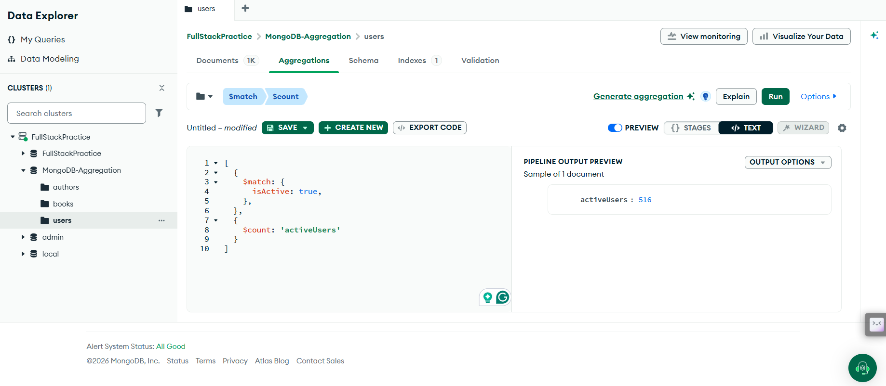

### MONGODB AGGREGATION

## File 1: Author.mongodb.js -- It contains Authors Data.
## File 2: Books.mongodb.js -- It contains Books Data.
## File 3: Users.mongodb.js -- It contains Users Data. How many Users Read these Authors Books.

Question:1- How many Users are Active ?

Question:2- What is the Average age of all Users ?

