<div align="center">
  
  
  # 🍃 MongoDB Aggregation Pipeline Masterclass
  **A comprehensive collection of real-world aggregation scenarios, queries, and pipeline architectures.**
  
  [](#)
  [](#)
  [](#)

</div>

---

## 📖 About This Repository
This repository contains a structured set of challenges and solutions designed to master the **MongoDB Aggregation Framework**. It progresses from basic matching and counting to complex array manipulations, regex filtering, multi-stage data transformations, and cross-collection joins.

## 🗄️ Dataset Architecture
The exercises are built on top of three core collections representing a reading platform:

| File Name | Description |
| :--- | :--- |
| 🧑‍💻 `Users.mongodb.js` | User demographics, preferences, tags, activity status, and reading history. |
| 📚 `Books.mongodb.js` | Book inventory, titles, genres, and metadata. |
| ✍️ `Author.mongodb.js` | Author profiles, bibliographies, and publishing details. |

---

## 🚀 Aggregation Scenarios

### 1️⃣ Basic Filtering & Counting
> **Objective:** How many Users are Active?
> **Operators Used:** `$match`, `$count`

<div align="center">
  
</div>

---

### 2️⃣ Data Grouping & Averages
> **Objective:** What is the Average age of all Users?
> **Operators Used:** `$group`, `$avg`

<div align="center">
  
</div>

---

### 3️⃣ Multi-Stage Sorting & Limiting
> **Objective:** List the Top 5 most common Favorite Fruits among the Users.
> **Operators Used:** `$group`, `$sum`, `$sort`, `$limit`

<div align="center">
  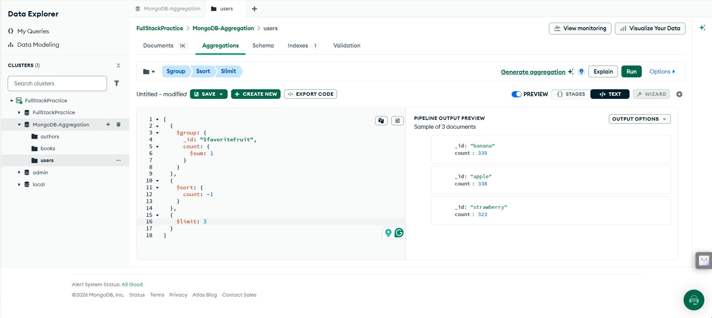
</div>

---

### 4️⃣ Categorical Summation
> **Objective:** Find the Total number of Males and Females.
> **Operators Used:** `$group`, `$sum`

<div align="center">
  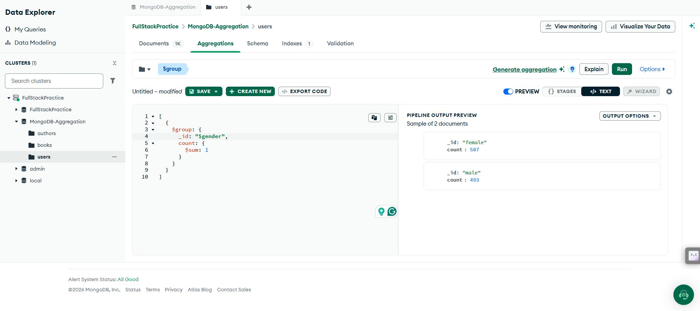
</div>

---

### 5️⃣ Geographical Aggregation
> **Objective:** Which Country has the Highest number of Registered Users?
> **Operators Used:** `$group`, `$sum`, `$sort`, `$limit`

<div align="center">
  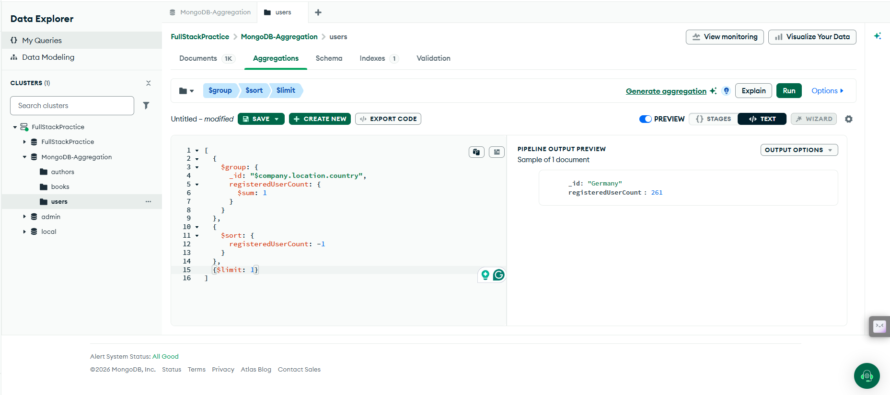
</div>

---

### 6️⃣ Extracting Unique Values
> **Objective:** List all the Unique Eye Colors present in the Collection.
> **Operators Used:** `$group` (by specific field)

<div align="center">
  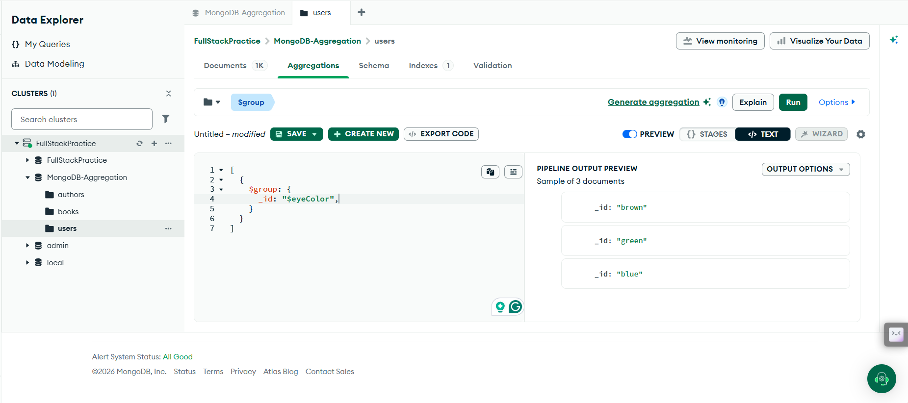
</div>

---

### 7️⃣ Array Manipulation (Two Approaches)
> **Objective:** What is the Average number of Tags per User?
> **Operators Used:** `$unwind`, `$group` **OR** `$addFields`, `$size`

#### Method A: Using Unwind
<div align="center">
  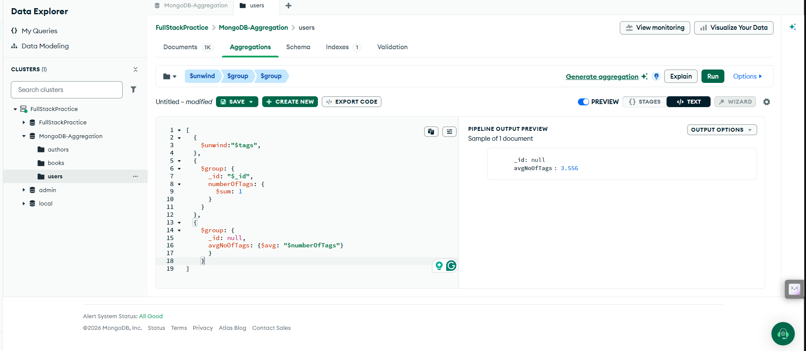
</div>

#### Method B: Using AddFields (More Efficient)
<div align="center">
  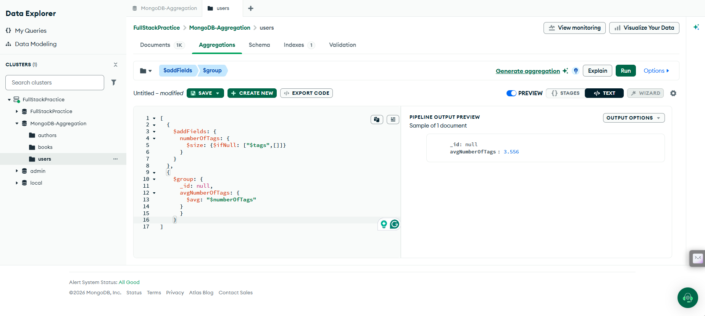
</div>

---

### 8️⃣ Array Querying
> **Objective:** How many Users have "enim" as One of their Tags?
> **Operators Used:** `$match` (Array implicit match), `$count`

<div align="center">
  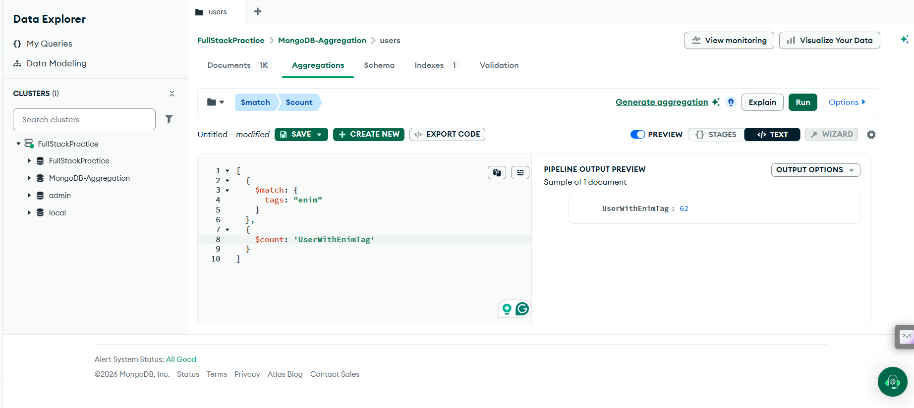
</div>

---

### 9️⃣ Complex Matching & Projection
> **Objective:** What are the Names and Age of Users Who are Inactive and have 'velit' as a Tag?
> **Operators Used:** `$match`, `$project`

<div align="center">
  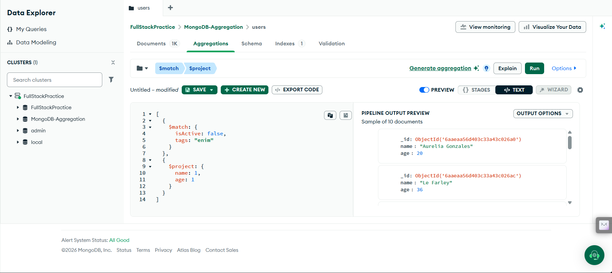
</div>

---

### 🔟 Regular Expressions (Regex) in Pipelines
> **Objective:** How many Users have a Phone Number Starting with `+1 (940)`?
> **Operators Used:** `$match`, `$regex`

<div align="center">
  
</div>

---

### 1️⃣1️⃣ Time-Based Sorting
> **Objective:** Who has Registered the Most Recently?
> **Operators Used:** `$sort`, `$limit`, `$project`

<div align="center">
  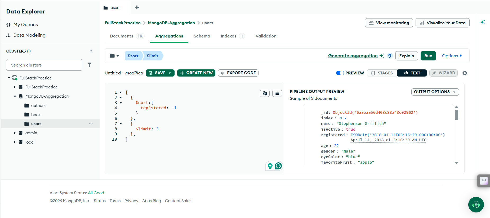
</div>

---

### 1️⃣2️⃣ Data Reshaping with Arrays
> **Objective:** Categorize Users by their Favorite Fruit.
> **Operators Used:** `$group`, `$push`

<div align="center">
  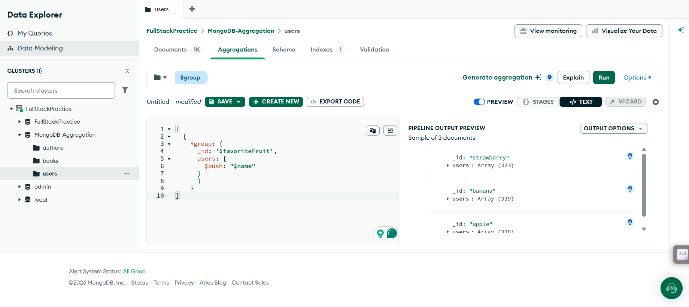
</div>

---

### 1️⃣3️⃣ Positional Array Querying
> **Objective:** How many Users have 'ad' as the *Second* Tag in their List of Tags?
> **Operators Used:** `$match` (Dot notation `tags.1`), `$count`

<div align="center">
  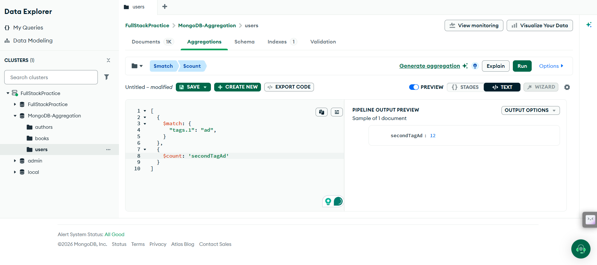
</div>

---

### 1️⃣4️⃣ Exact Array Intersections
> **Objective:** Find Users who have Both 'enim' and 'id' as their Tag.
> **Operators Used:** `$match`, `$all`

<div align="center">
  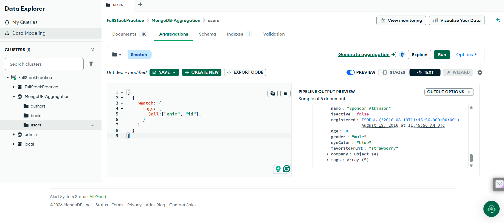
</div>

---

### 1️⃣5️⃣ Nested Object Grouping
> **Objective:** List all the companies located in the 'USA' with their corresponding User Count.
> **Operators Used:** `$match`, `$group`, `$sum`

<div align="center">
  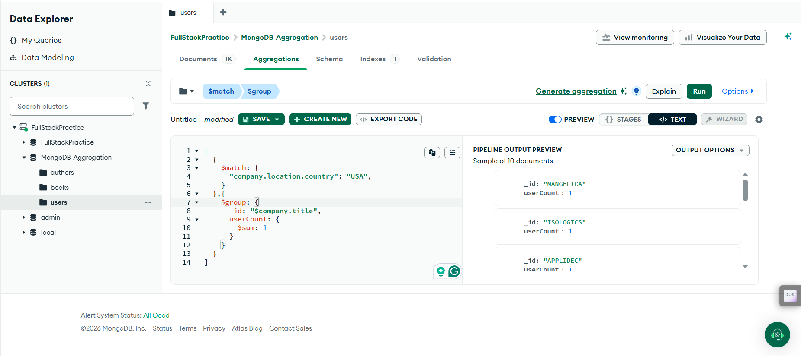
</div>

---

### 1️⃣6️⃣ Cross-Collection Joins (`$lookup`) & Array Unpacking
> **Objective:** Combine book records with their corresponding author details to get a complete picture in a single query, then unpack the resulting array.
> **Operators Used:** `$lookup`, `$addFields`, `$arrayElemAt`

💡 **What is `$lookup`?**  
In MongoDB NoSQL databases, data is often separated into different collections (like Books and Authors). The `$lookup` operator works exactly like a `JOIN` in a traditional SQL database. It allows you to grab related data from another collection and embed it directly into your current results. 

🛠️ **How to practice this:**
1. Open your MongoDB database client.
2. Click on the **`books`** collection to open it.
3. Navigate to the **Aggregations** tab.
4. Type or paste the pipeline code into the text editor.

#### 🏗️ The `$lookup` & `$addFields` Blueprint
Here is the core blueprint for writing a lookup stage. Because `$lookup` always returns an **array** of matches, we chain it with an `$addFields` stage using `$arrayElemAt` to cleanly extract the first object from that array:

<div align="center">
  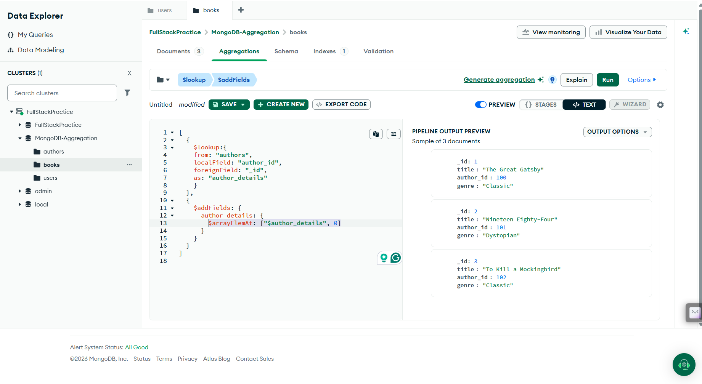
</div>

#### 🌍 Real-World Implementation Preview:
<div align="center">
  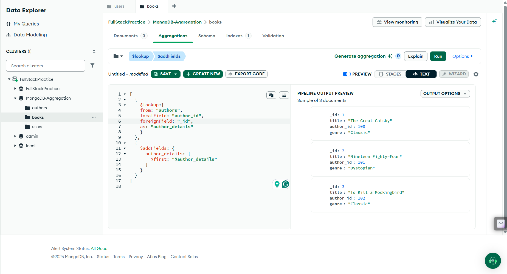
</div>

### 💻 Code Example
```javascript
[
  {
    $lookup: {
      from: "authors", // The target collection to join
      localField: "author_id", // The reference ID in your CURRENT collection
      foreignField: "_id", // The matching ID in the TARGET collection
      as: "author_details" // The new array field where joined data is saved
    }
  },
  {
    $addFields: {
      author_details: {
        $arrayElemAt: ["$author_details", 0] // Extracts the object at index 0
      }
    }
  }
]
 ```

 <br>
 

<div align="center">
  <i>Happy Querying! 🚀 Built for the Chai Cohort</i>
</div>