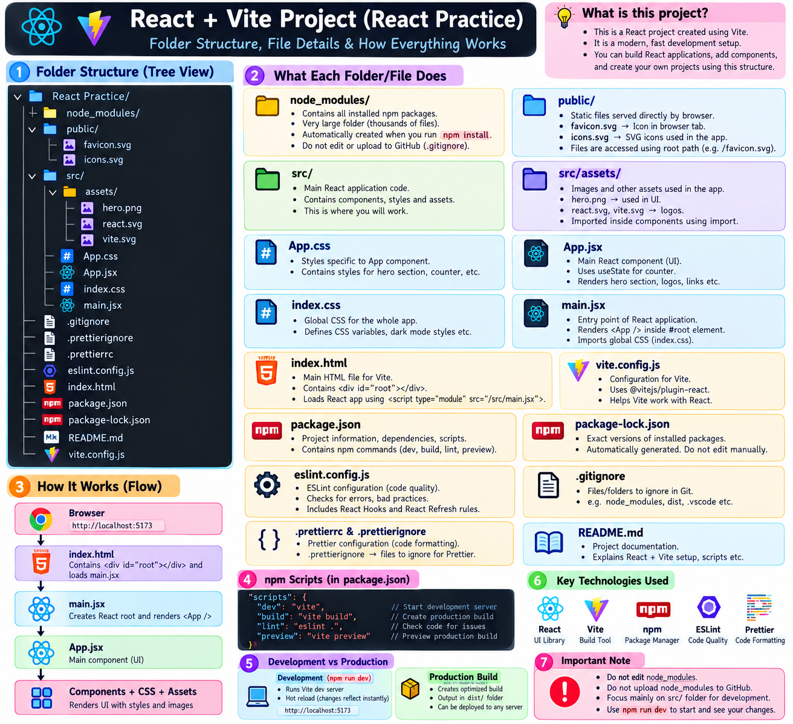
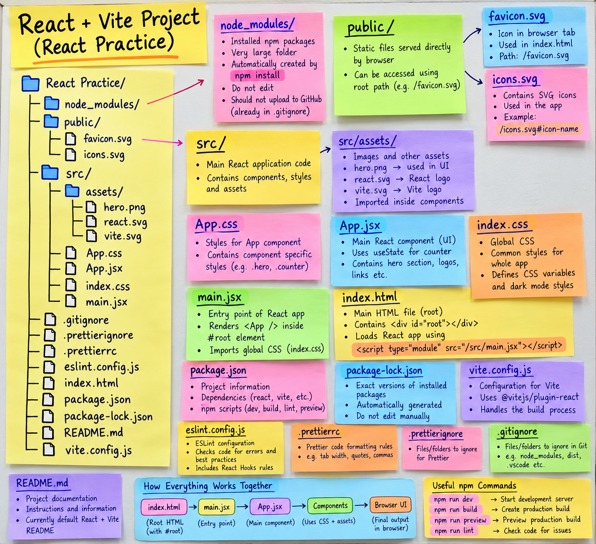
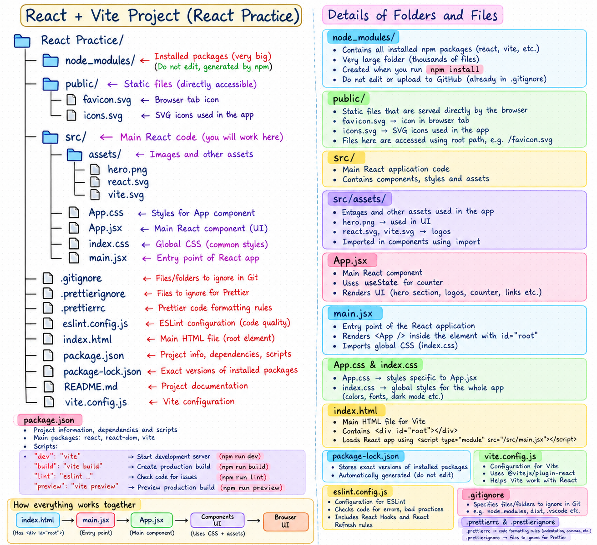

# 🚀 Week 19: Full-Stack Web Development & React Deep-Dive
> **Chai Aur Code Cohort — Full-Stack Web Development Series**

[](https://nodejs.org/)
[](https://expressjs.com/)
[](https://react.dev/)
[](https://vitejs.dev/)
[](https://www.prisma.io/)
[](https://www.postgresql.org/)
[](https://tailwindcss.com/)
[](https://jwt.io/)

Welcome to **Week 19** of the Chai Aur Code Cohort! This repository encompasses a production-grade full-stack web application featuring secure authentication workflows, robust backend API architecture with Prisma ORM and PostgreSQL, a responsive modern React frontend with Tailwind CSS, along with dedicated React fundamentals exploration and visual study notes.

---

## 📸 Visual Learning & Architecture Notes

Visual artifacts and technical diagrams outlining the request lifecycle, authentication workflows, database schemas, and key full-stack concepts:

| Architecture & Flow Visualization | Key Takeaways & Sticky Notes | Handwritten Schema Diagrams |
| :---: | :---: | :---: |
|  |  |  |
| *Full-Stack Architecture & Request Flow* | *Core Technical Notes & Concepts* | *Database & Auth Workflow Diagrams* |

---

## 📂 Repository Structure

```
Week-19/
├── 📁 Assets/                          # Visual diagrams, study notes & visual assets
│   ├── handwritten.png                 # Detailed handwritten workflow & schema diagrams
│   ├── stickyNotes.png                 # Summary notes & key technical takeaways
│   └── visualizeLearning.png           # Architecture & concept roadmap
│
├── 📁 FullStack Practice/              # Complete Full-Stack Authentication Project
│   ├── 📁 Backend/                     # Express.js (v5) + Prisma ORM + PostgreSQL Backend API
│   │   ├── controllers/                # Business logic (register, login, verify, reset, logout)
│   │   ├── routes/                     # REST API endpoints (/api/v1/users)
│   │   ├── utils/                      # Database client singletons (Prisma instance)
│   │   ├── prisma/                     # Database schema definition & migration history
│   │   ├── index.js                    # Express app entry point & server setup
│   │   ├── prisma.config.ts            # Prisma connection & migration config
│   │   ├── .env.sample                 # Environment variable configuration template
│   │   └── package.json                # Server dependencies & npm scripts
│   │
│   └── 📁 Frontend/                    # React + Vite + Tailwind CSS Client Application
│       ├── Services/                   # API client service layer (`apiClient.js`)
│       ├── src/                        # React components, pages & state logic
│       │   ├── components/             # Reusable UI components (Login, Signup, etc.)
│       │   ├── App.jsx                 # Main application view & router structure
│       │   └── main.jsx                # React root mount entry point
│       └── package.json                # Frontend dependencies & scripts
│
└── 📁 REACTLEARNING/                   # Dedicated React Deep-Dive Sandbox
    └── 📁 React Practice/              # React state management & hooks practice (Vite + HMR)
        ├── src/                        # Interactive React state & counter experiments
        └── package.json                # Playground build configuration
```

---

## 🌟 Modules & Features Breakdown

### 1. 🛡️ Full-Stack Authentication Practice (`FullStack Practice/`)

A production-ready full-stack authentication system designed around security best practices, clean controller-service architecture, and type-safe database access.

#### 🔧 Backend Highlights (`FullStack Practice/Backend`)
- **Express.js v5**: Next-gen routing and improved asynchronous error handling.
- **Prisma ORM & PostgreSQL**: Type-safe relational database queries targeting PostgreSQL / Neon Serverless.
- **JWT HTTP-Only Cookie Authentication**: Secure session handling preventing XSS token theft.
- **Password Hashing**: Bcrypt salting (10 rounds) for password protection.
- **Automated Email Verification**: Verification tokens dispatched upon user registration using Nodemailer & Mailtrap SMTP.
- **Timed Password Reset Workflow**: 1-hour expiration time window for reset links.

#### 🗄️ Database Schema (`User` Model)
```prisma
model User {
  id                  String   @id @default(cuid())
  name                String
  email               String   @unique
  phone               String?  @unique
  password            String
  role                String   @default("user")
  isVerified          Boolean  @default(false)
  verificationToken   String?
  passwordResetToken  String?
  passwordResetExpiry String?
  createdAt           DateTime @default(now())
  updatedAt           DateTime @default(now())
}
```

#### 📡 Backend API Endpoints Reference

| Method | Endpoint | Description | Auth Required |
| :--- | :--- | :--- | :---: |
| `GET` | `/api/v1/users/` | Server Health Check | ❌ |
| `POST` | `/api/v1/users/register` | Register new user & send verification email | ❌ |
| `POST` | `/api/v1/users/login` | Authenticate user & attach HTTP-Only JWT cookie | ❌ |
| `GET` | `/api/v1/users/verify/:token` | Validate email verification link | ❌ |
| `POST` | `/api/v1/users/forgot-password` | Generate & email password reset link | ❌ |
| `POST` | `/api/v1/users/reset-password/:token` | Process new password using token | ❌ |
| `POST` | `/api/v1/users/logout` | Clear HTTP-Only authentication cookie | ❌ |

---

#### 🎨 Frontend Highlights (`FullStack Practice/Frontend`)
- **React 19 + Vite**: High-performance client bundling with instant Hot Module Replacement (HMR).
- **Tailwind CSS**: Utility-first styling for responsive UI layouts.
- **Modular Component Architecture**: Decoupled `Login` and `Signup` components with client-side state handling.
- **Centralized API Service**: Encapsulated HTTP request handler (`apiClient.js`) configured for cross-origin credentials.

---

### 2. ⚛️ React Learning & Playground (`REACTLEARNING/`)

A dedicated environment for practicing core React paradigms:
- **Hooks & State Management**: Deep dive into `useState` state dynamics and UI re-rendering cycles.
- **Component Lifecycle & HMR**: Understanding DOM reactivity and hot module reloading via Vite.
- **Custom UI Micro-interactions**: State-driven UI updates and event handlers.

---

## ⚡ Quick Start Guide

### Prerequisites
- **Node.js** (v18.x or higher)
- **npm** (v9.x or higher)
- **PostgreSQL Database** (local instance or free [Neon Postgres](https://neon.tech/))

---

### 1️⃣ Setting Up the Backend Server

```bash
# Navigate to the backend folder
cd "FullStack Practice/Backend"

# Install backend dependencies
npm install

# Copy sample environment variables file
cp .env.sample .env
```

> ⚙️ **Update `.env`** with your database connection URL (`DATABASE_URL`), `JWT_SECRET`, and Mailtrap credentials.

```bash
# Generate Prisma Client & Sync Database Schema
npx prisma generate
npx prisma db push

# Start Backend Server in Development Mode
npm run dev
```
*The server will start at `http://localhost:4000`*

---

### 2️⃣ Setting Up the Frontend Client

```bash
# Open a new terminal and navigate to the frontend folder
cd "FullStack Practice/Frontend"

# Install frontend dependencies
npm install

# Start Vite Development Server
npm run dev
```
*The React application will launch at `http://localhost:5173`*

---

### 3️⃣ Running the React Practice Sandbox

```bash
# Navigate to the React Practice folder
cd "REACTLEARNING/React Practice"

# Install dependencies and launch app
npm install
npm run dev
```

---

## 🎯 Key Concepts & Takeaways

1. **Defense in Depth**: Utilizing `HTTP-Only` cookies for JWT tokens protects against client-side XSS attacks compared to `localStorage`.
2. **Stateless Timed Tokens**: Implementing crypto-generated random tokens with expiration timestamps for safe, un-forgeable account actions (verification & password resets).
3. **Prisma ORM Power**: Type safety from schema definition down to controller queries prevents runtime database mismatches.
4. **Decoupled Architecture**: Keeping API calls inside a dedicated service layer (`apiClient.js`) enables easy maintenance and scaling.

---

## 👥 Author & Acknowledgments

- **Author**: Uditya Pal
- **Course**: Chai Aur Code Cohort by Hitesh Choudhary
- **License**: ISC

---
*Happy Coding! ☕✨*
